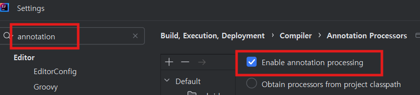
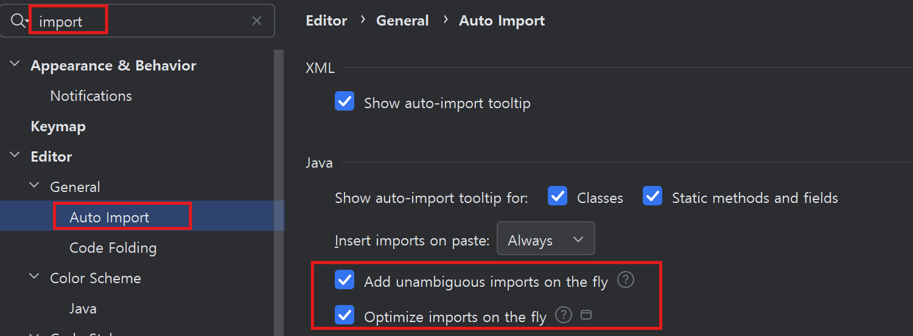
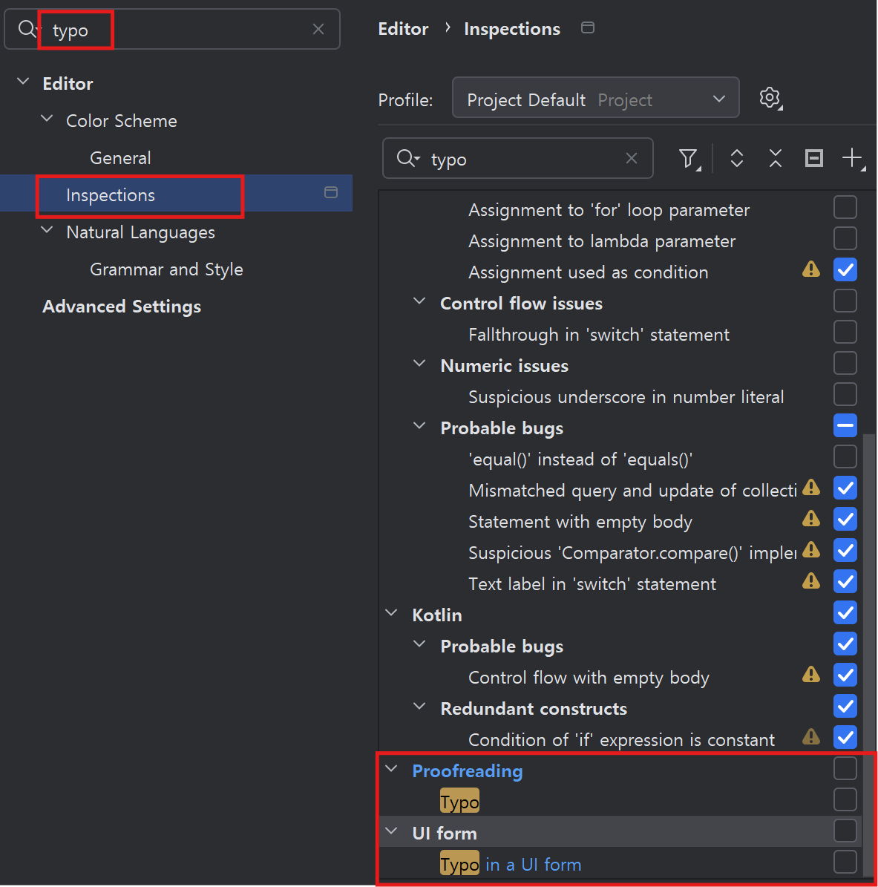

# 작업 환경 설정

## 목차
- [작업 환경 설정](#작업-환경-설정)
  - [목차](#목차)
  - [로컬 환경 설정](#로컬-환경-설정)
  - [IntelliJ 환경 설정](#intellij-환경-설정)

---

## 로컬 환경 설정 
아래 링크를 눌러 로컬 작업 환경을 설정하세요.  
[로컬 환경 설정](https://github.com/cna-bootcamp/cna-handson/blob/main/prepare/%EB%A1%9C%EC%BB%AC%EA%B0%9C%EB%B0%9C%ED%99%98%EA%B2%BD%EA%B5%AC%EC%84%B1.md#%EB%A1%9C%EC%BB%AC-%EA%B0%9C%EB%B0%9C-%ED%99%98%EA%B2%BD-%EA%B5%AC%EC%84%B1)

맨 마지막 'SSH Login 설정(Mac/Linux Only)'은 하지 마십시오.

| [Top](#목차) |

---

## IntelliJ 환경 설정
- Lombok설치
  Lombok은 클래스의 생성자, Getter(프라퍼티값을 읽는 메소드), Setter(프라퍼티값을 변경하는 메소드)등을    
  자동으로 작성해 주는 라이브러리입니다.    
  Lombok을 사용하면 어노테이션만 지정하면 이러한 메소드들을    
  자동으로 만들어 주기 때문에 편하고 코드도 깔끔해집니다.    

- Lombok plugin을 설치합니다. 
  

- Annotation Processor를 활성화 합니다.    
  IDE에서 Lombok을 사용하려면 반드시 아래 셋팅을 해야 합니다. 
  이 설정은 영구설정이 아니므로 새로운 프로젝트를 만들때마다 해줘야 합니다.   
  멀티프로젝트는 최상위 프로젝트 생성하고 한번 하면 됩니다.        
  

- 라이브러리 자동 import 옵션    
  첫번째 옵션은 코드 작성 중 필요한 라이브러리를 자동 import해 주는 것이고,   
  두번째 옵션은 불필요한 라이브러리 import를 자동으로 제거해 주는 옵션입니다.   
    

- 오타 검사 옵션 비활성화  
  코드나 주석에 오타를 체크해 주는 옵션입니다.   
  활성화 되어 있으면 컴파일 Warning갯수가 자꾸 보여서 눈에 거슬립니다.   
  

| [Top](#목차) |

---
