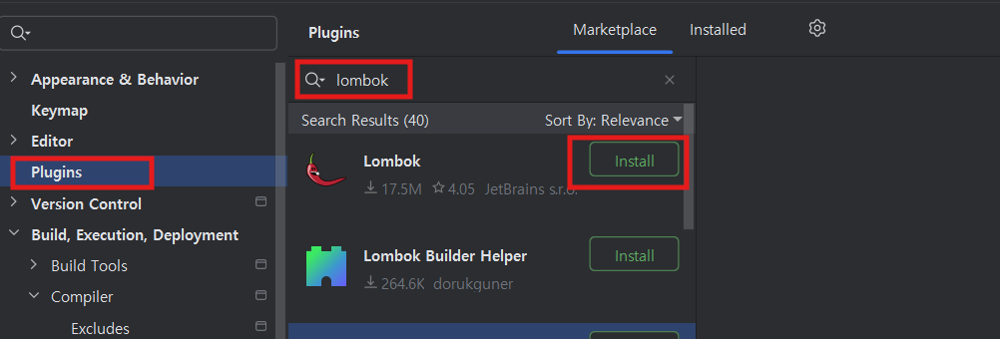
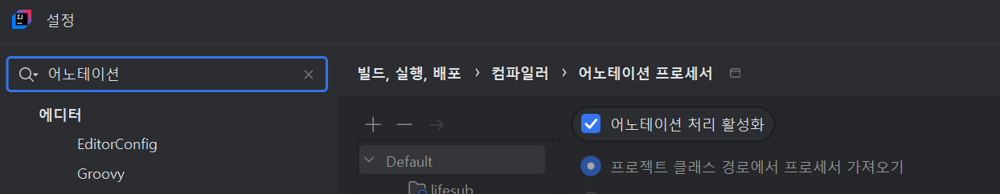
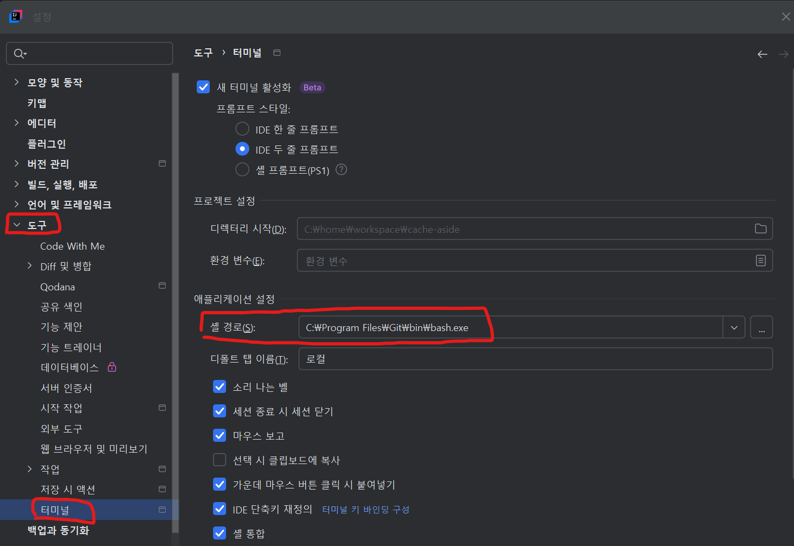

# 작업 환경 설정

## 목차
- [작업 환경 설정](#작업-환경-설정)
  - [목차](#목차)
  - [로컬 환경 설정](#로컬-환경-설정)
  - [IntelliJ 환경 설정](#intellij-환경-설정)
  - [Visual Studio Code 설정](#visual-studio-code-설정)
  - [Git 설정](#git-설정)

---

## 로컬 환경 설정 
아래 링크를 눌러 로컬 작업 환경을 설정하세요.  
[로컬 환경 설정](https://github.com/cna-bootcamp/cna-handson/blob/main/prepare/%EB%A1%9C%EC%BB%AC%EA%B0%9C%EB%B0%9C%ED%99%98%EA%B2%BD%EA%B5%AC%EC%84%B1.md#%EB%A1%9C%EC%BB%AC-%EA%B0%9C%EB%B0%9C-%ED%99%98%EA%B2%BD-%EA%B5%AC%EC%84%B1)


맨 마지막 'SSH Login 설정(Mac/Linux Only)'은 하지 마십시오.

| [Top](#목차) |

---

## IntelliJ 환경 설정
- Lombok설치
  Lombok은 클래스의 생성자, Getter(프라퍼티값을 읽는 메소드), Setter(프라퍼티값을 변경하는 메소드)등을    
  자동으로 작성해 주는 라이브러리입니다.    
  Lombok을 사용하면 어노테이션만 지정하면 이러한 메소드들을    
  자동으로 만들어 주기 때문에 편하고 코드도 깔끔해집니다.    

- Lombok plugin을 설치합니다. 
  

- Annotation Processor를 활성화 합니다.    
  IDE에서 Lombok을 사용하려면 반드시 아래 셋팅을 해야 합니다. 
  이 설정은 영구설정이 아니므로 새로운 프로젝트를 만들때마다 해줘야 합니다.   
  멀티프로젝트는 최상위 프로젝트 생성하고 한번 하면 됩니다.    
    

- 라이브러리 자동 import 옵션    
  첫번째 옵션은 코드 작성 중 필요한 라이브러리를 자동 import해 주는 것이고,   
  두번째 옵션은 불필요한 라이브러리 import를 자동으로 제거해 주는 옵션입니다.   
    

- 오타 검사 옵션 비활성화  
  코드나 주석에 오타를 체크해 주는 옵션입니다.   
  활성화 되어 있으면 컴파일 Warning갯수가 자꾸 보여서 눈에 거슬립니다.   
    

  
- 기본 Shell 변경  
    
    
| [Top](#목차) |

---

## Visual Studio Code 설정 

- 기본 터미널을 Git Bash로 변경합니다.   
  VS Code를 실행하고 Ctrl + ,를 눌러 설정(Settings)을 엽니다.   
  검색창에 "terminal default profile"을 입력합니다.   
  "Terminal > Integrated > Default Profile: Windows" 설정을 찾습니다.   
  드롭다운 메뉴에서 "Git Bash"를 선택합니다.   
  
- 디렉토리가 중첩 표시를 해제 합니다.  
    


| [Top](#목차) |

---

## Git 설정
Git을 쓰는 클라이언트(PC, Local ubuntu, VM등)에서 최초에 아래 설정을 해주셔야 합니다.  
먼저 로컬 Git repository로 이동 합니다.  
아직 없으면 아무 디렉토리에서 아래 명령으로 만듭니다.  
```
mkdir -p ~/workspace/tmp
cd ~/workspace/tmp
git config --global init.defaultBranch main
git init 
```

1.username, email 셋팅  
```
git config --global user.name "{이름}"
git config --global user.email "{email}"
```
예시)
```
git config --global user.name "ondal"
git config --global user.email "hiondal@gmail.com"
```

2.credentail 설정  
원격 Git에서 pull/push할 때 매번 비밀번호를 입력하는것은 매우 번거롭습니다.  
아래 명령으로 영구 설정 하십시오.  
최초 한번만 물어보고 로컬에 저장되어 다시 묻지 않게 됩니다.  
```
git config credential.helper store --global
```
만약, 보안상 일정 기간만 저장하고 싶으면 아래와 같이 하십시오.   
```
git config credential.helper 'cache --timeout={초}'
``` 
예시) 10시간 동안만 저장
```
git config credential.helper 'cache --timeout=36000'
``` 

> 참고: Git 사용법  
> https://happycloud-lee.tistory.com/93


| [Top](#목차) |

---
