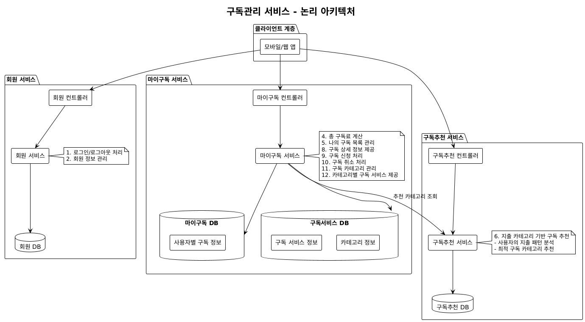
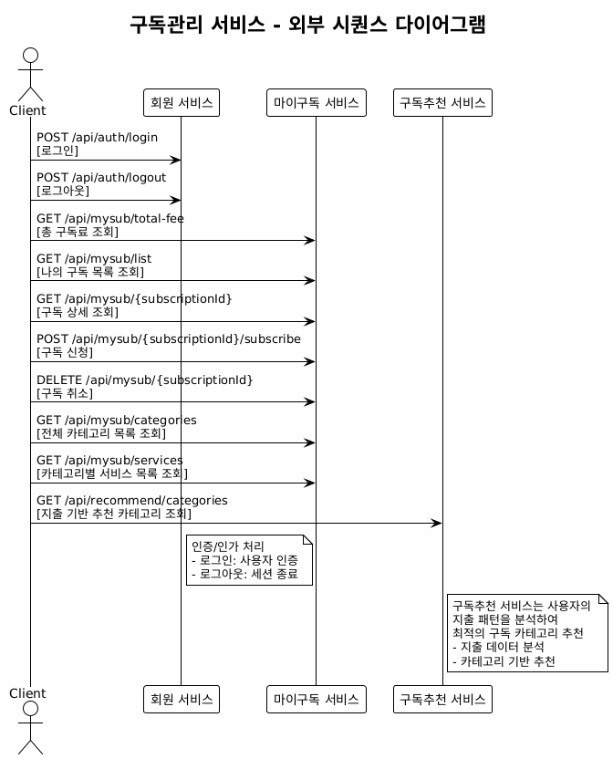
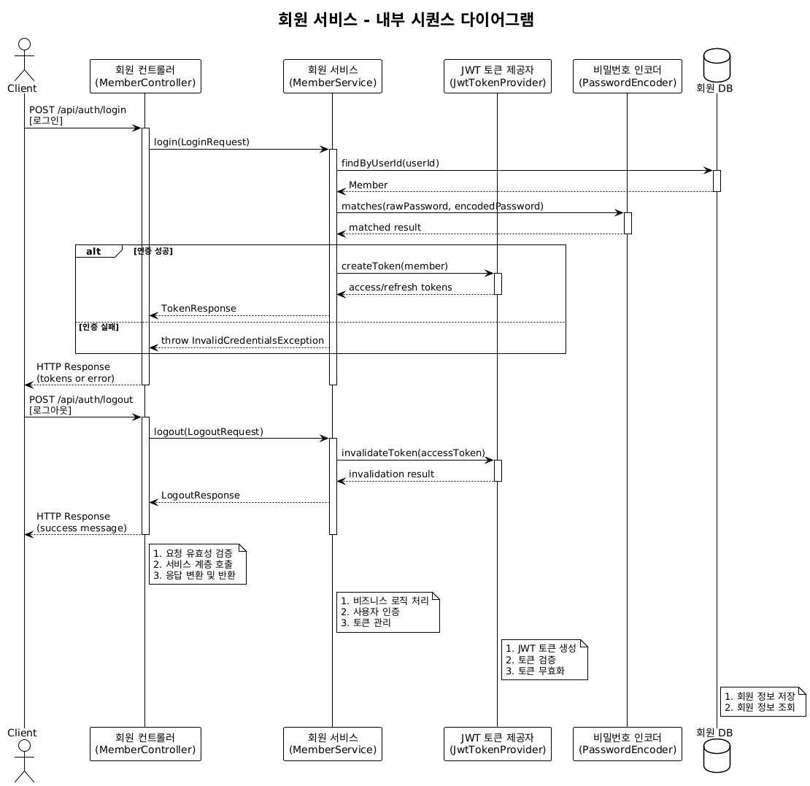
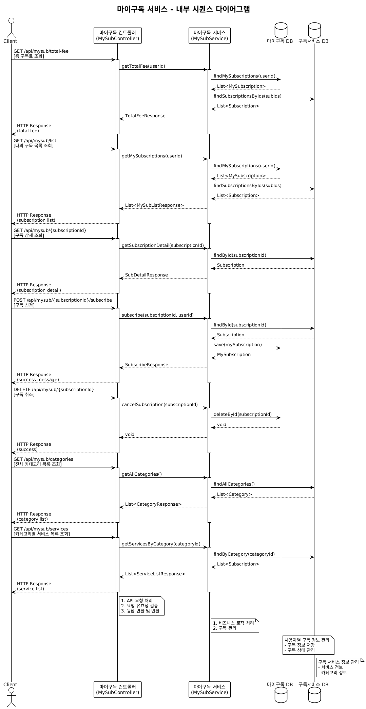
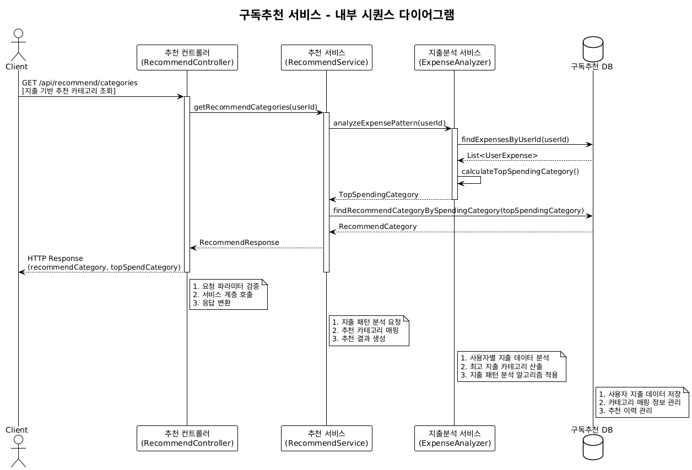
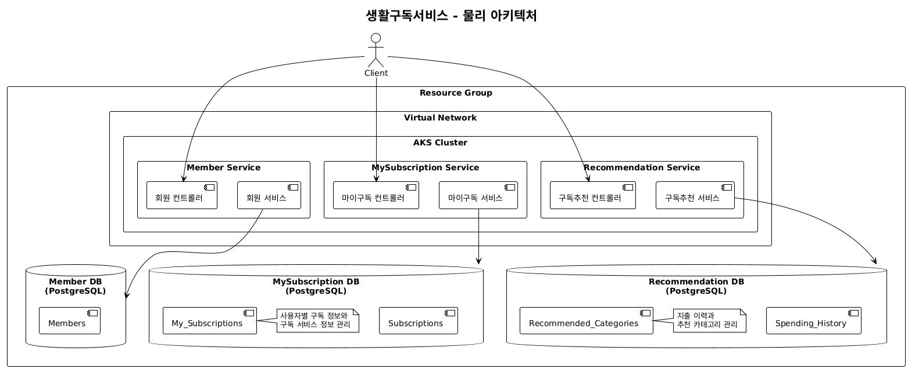

# Design 가이드 

## 목차
- [Design 가이드](#design-가이드)
  - [목차](#목차)
  - [Claude Project 생성 및 구성](#claude-project-생성-및-구성)
  - [논리 아키텍처 작성](#논리-아키텍처-작성)
  - [API 설계](#api-설계)
  - [시퀀스 설계](#시퀀스-설계)
    - [외부 시퀀스 설계](#외부-시퀀스-설계)
    - [내부 시퀀스 설계](#내부-시퀀스-설계)
    - [Class 설계](#class-설계)
    - [Data 설계](#data-설계)
    - [물리아키텍처](#물리아키텍처)

---

## Claude Project 생성 및 구성
- Claude Project 생성
  Claude Project 에서 새로운 프로젝트를 생성  
  ```
  Name: 생활구독서비스 스쿼드  
  설명: 생략
  ```   
- Instruction 작성
  'claude_instruction.txt' 파일 내용을 복사하여 Instruction로 추가  

- Knowledge에 참조 자료 등록   
  - Userstory.pdf
  - sample로 시작하는 UML설계 예제 파일들을 Knowledge에 업로드   
  - 개발주석표준.txt
  - 패키지 구조 표준.txt  

| [Top](#목차) |

---

## 논리 아키텍처 작성  
아래 프롬프트로 논리 아키텍처를 설계함  
```
d: Userstory기반의 논리 아키텍처를 설계해 주세요. 
- 서비스는 회원, 마이구독, 구독추천으로 구성 
- 유저스토리와 수용기준을 분석하여 Flow를 표현 
- 유저스토리에 없는 것은 표현하지 말것
- plantuml script로 작성
```


결과를 검토하고 클로딩(Clauding)하여 완성함.   
완성된 설계 내용을 '논리아키텍처'라는 이름으로 Knowledge에 등록   

| [Top](#목차) |

---

## API 설계
프롬프트
```
d: API 설계를 해주세요. 
```

결과를 검토하고 클로딩(Clauding)하여 완성함.   
완성된 설계 내용을 'API설계서'라는 이름으로 Knowledge에 등록

| [Top](#목차) |

---

## 시퀀스 설계
### 외부 시퀀스 설계
프롬프트
```
d: 외부 시퀀스 설계를 해주세요. 
```


### 내부 시퀀스 설계
```
d: 회원 서비스의 내부 시퀀스 설계를 해주세요.
```
결과를 검토하고 클로딩(Clauding)하여 완성함.   


```
d: 마이구독 서비스의 내부 시퀀스 설계를 해주세요.
```
결과를 검토하고 클로딩(Clauding)하여 완성함.   


```
d: 구독추천 서비스의 내부 시퀀스 설계를 해주세요.
```
결과를 검토하고 클로딩(Clauding)하여 완성함.   



완성된 설계 내용을 모두 합쳐서 'Sequence 설계서'라는 이름으로 Knowledge에 등록

| [Top](#목차) |

---

### Class 설계
```
d: Class 설계를 해주세요. 
-  ORG: unicorn
- ROOT: lifesub
- SERVICE: member, mysub, recommend
- 아키텍처 패턴
   - member: Layered
   - mysub: Clean
   - recommend: Layered
```

결과를 검토하고 클로딩(Clauding)하여 완성함.
완성된 설계 내용을 모두 합쳐서 'Class 설계서'라는 이름으로 Knowledge에 등록
또한 패키지 구조도를 '패키지 구조도'라는 이름으로 Knowledge에 등록

| [Top](#목차) |

---

### Data 설계
```
d: Data 설계를 해 주세요. Class 설계서의 각 서비스별 entity와 일치해야 합니다.
```

결과를 검토하고 클로딩(Clauding)하여 완성함.
```
o: Class 설계서의 각 서비스별 entity와 일치하는지 검토하고 수정된 데이터 설계서를 보여주세요. 
```

완성된 설계 내용을 모두 합쳐서 'Data 설계서'라는 이름으로 Knowledge에 등록

| [Top](#목차) |

---

### 물리아키텍처
```
d: 물리 아키텍처를 설계 해 주세요. '논리 아키텍처'와 'Data 설계서와' 일치해야 합니다.
```

결과를 검토하고 클로딩(Clauding)하여 완성함.


완성된 설계 내용을 모두 합쳐서 '물리아키텍처'라는 이름으로 Knowledge에 등록

| [Top](#목차) |
