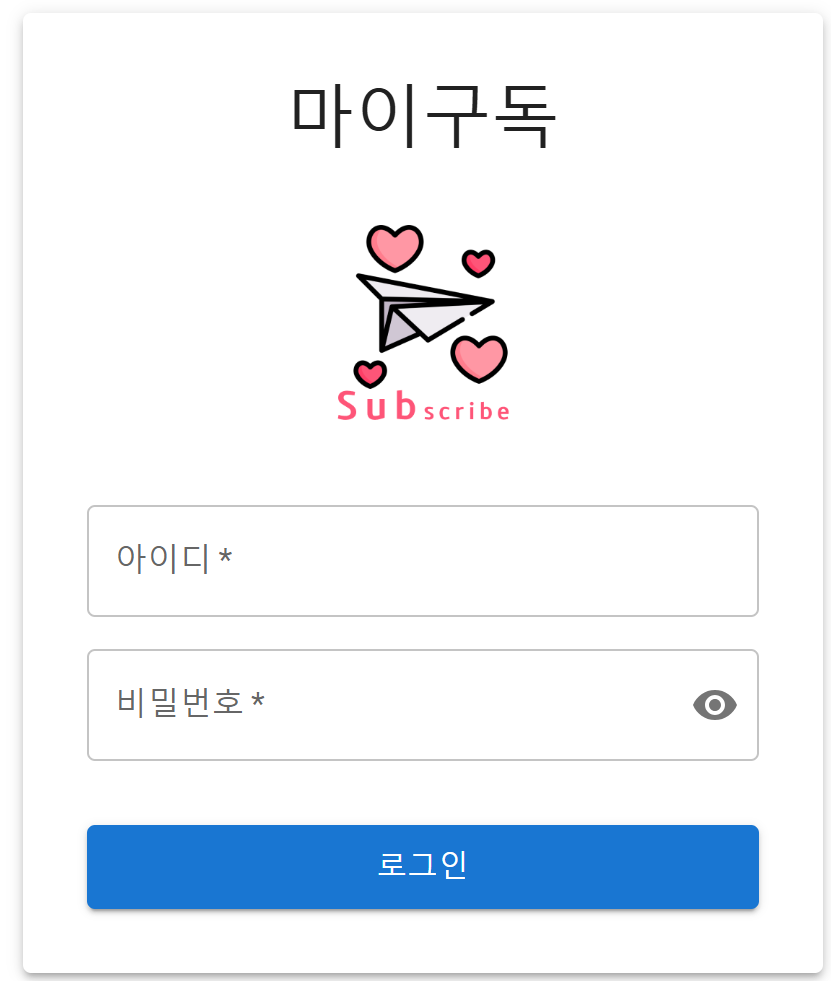

# Frontend Coding 가이드 

## 목차
- [Frontend Coding 가이드](#frontend-coding-가이드)
  - [목차](#목차)
  - [개발](#개발)
  - [애플리케이션 이해](#애플리케이션-이해)
    - [패키지 구성도](#패키지-구성도)
    - [React로 개발하는 방법](#react로-개발하는-방법)
  - [테스트](#테스트)

---

## 개발
- Knowledge에 백엔드 개발 소스를 한 파일로 통합하여 업로드

  ```
  cd ~/workspace
  python3 mergesrc.py 
  # 소스 디렉토리명 (기본값: ): lifesub
  ```
  현재 디렉토리에 생성된 MergedSource.java를 업로드 함

- 코딩   
  ```
  c: 프론트엔드 개발을 시작해 주세요. 
  ```   
- 프로젝트 디렉토리 구성    
  제공된 패키지 구성도를 보고 프로젝트 디렉토리와 파일을 생성  
  npx를 이용한 프로젝트 생성은 참고만 하십시오.  
  시간도 오래 걸리고 어차피 생성된 파일 내용을 변경해야 하기 때문입니다.  

- 이미지 파일 복사  
  'lifesub-images'디렉토리 하위의 이미지 파일들을 애플리케이션의 'public/images'폴더에 복사합니다.  

- 소스 완성  
  제공된 각 소스를 채워넣음.    

- 프로그램 보완
  1차 코딩 완료 후 실행을 위한 모든 코드가 개발되었는지 체크
  ```
  o: 실행을 위해 필요한 모든 파일이 개발되었는지 체크해 주세요.
  ```

- 애플리케이션 실행 
  package.json에 정의된 라이브러리를 설치합니다.  
  ```
  npm install 
  ```  

  애플리케이션을 실행합니다.  
  ```
  npm start 
  ```

- 에러 Fix
  실행 후 에러 메시지를 제공하여 버그를 픽스함  
  
> Tip: 소스 merge하기 
> 'merge-node.py'파일을 'workspace'디렉토리에 다운로드 후 실행  
> ```
> python3 merge-node.py lifesub-web
> Successfully created lifesub-web_merged.txt
> ```


> Tip: 예제 코드  
>   
> 시간이 없거나 에러가 잘 안 잡히면 아래 소스를 이용하여 실습을 하십시오.  
> 예제 소스는 아래와 같이 다운로드 할 수 있습니다.   
> ```
> cd ~/workspace  
> git clone https://github.com/cna-bootcamp/lifesub-web.git  
> ```

| [Top](#목차) |

---

## 애플리케이션 이해    
예제로 작성된 프론트엔드 애플리케이션에 대해 이해해 봅시다.  
소스는 아래 GitGub Repository에서 다운로드 할 수 있습니다.   
https://github.com/cna-bootcamp/lifesub-web.git  

### 패키지 구성도  
```
lifesub-web/               # React 프로젝트 루트
├── public/                # 정적 리소스 디렉토리
│   ├── index.html        # 메인 HTML 파일
│   ├── manifest.json     # PWA 설정 파일
│   └── images/           # 이미지 리소스 디렉토리
│
├── src/                   # 소스코드 디렉토리
│   ├── components/       # 재사용 가능한 컴포넌트
│   │   ├── auth/        # 인증 관련 컴포넌트
│   │   │   └── LoginForm.js     # 로그인 폼
│   │   │
│   │   ├── common/      # 공통 컴포넌트
│   │   │   ├── ErrorMessage.js  # 에러 메시지 표시
│   │   │   ├── Header.js        # 헤더 영역
│   │   │   ├── Layout.js        # 레이아웃 구조
│   │   │   ├── LoadingSpinner.js # 로딩 인디케이터
│   │   │   └── SubscriptionCard.js # 구독 정보 카드
│   │   │
│   │   ├── main/        # 메인 화면 컴포넌트
│   │   │   ├── MySubscriptions.js  # 내 구독 목록
│   │   │   ├── RecommendCategory.js # 추천 카테고리
│   │   │   └── TotalFee.js         # 총 구독료 표시
│   │   │
│   │   └── subscriptions/ # 구독 관련 컴포넌트
│   │       ├── CategoryList.js     # 카테고리 목록
│   │       ├── SubscriptionDetail.js # 구독 상세정보
│   │       └── SubscriptionList.js   # 구독 목록
│   │
│   ├── contexts/        # Context API 관련
│   │   └── AuthContext.js  # 인증 상태 관리
│   │
│   ├── pages/           # 페이지 컴포넌트
│   │   ├── LoginPage.js           # 로그인 페이지
│   │   ├── MainPage.js            # 메인 페이지
│   │   ├── SubscriptionDetailPage.js # 구독 상세 페이지
│   │   └── SubscriptionListPage.js   # 구독 목록 페이지
│   │
│   ├── services/        # API 통신 관련
│   │   └── api.js       # API 클라이언트 설정
│   │
│   ├── utils/           # 유틸리티 함수
│   │   └── formatters.js # 포맷팅 유틸리티
│   │
│   ├── App.js           # 앱 메인 컴포넌트
│   ├── App.css          # 앱 스타일
│   ├── index.js         # 앱 진입점
│   └── index.css        # 전역 스타일
│
└── package.json         # 프로젝트 설정 및 의존성
```

### React로 개발하는 방법
React 애플리케이션 개발을 마이구독 서비스를 예시로 설명해드리겠습니다.

1. 프로젝트 시작하기  
먼저 React 프로젝트의 기본 구조를 이해해야 합니다. src 폴더를 보시면:

```jsx
// src/index.js - 앱의 시작점
import React from 'react';
import ReactDOM from 'react-dom/client';
import './index.css';
import App from './App';
import { BrowserRouter } from 'react-router-dom';

const root = ReactDOM.createRoot(document.getElementById('root'));
root.render(
  <React.StrictMode>
    <BrowserRouter>
      <App />
    </BrowserRouter>
  </React.StrictMode>
);
```

이 파일은 React 앱의 시작점입니다.  
'React.StrictMode'부분은 개발모드로 빌드할때만 동작하며 API를 두번 씩 호출하여   
메모리 누수, 사이드 이펙트, 예상치 못한 버그 등을 검사합니다.  
프로덕션 모드로 빌드할 때는 비활성화 됩니다. 
- 'npm start': 개발모드로 빌드하여 실행  
- 'npm run build': 프로덕션 모드로 빌드. 실행 시에는 nginx나 express같은 웹서버에서 빌드 결과 파일을 실행함     

BrowserRouter로 App 컴포넌트를 감싸서 라우팅 기능을 사용할 수 있게 합니다.  
'App'부분에 App.js의 내용을 embed됩니다.   

2. 라우팅 설정하기  
App.js에서 라우팅을 설정합니다:

```jsx
// src/App.js
function App() {
  return (
    <AuthProvider>
      <div className="App">
        <Routes>
          <Route path="/login" element={<LoginPage />} />
          <Route element={<Layout />}>
            <Route index element={<MainPage />} />
            <Route path="subscriptions" element={<SubscriptionListPage />} />
          </Route>
        </Routes>
      </div>
    </AuthProvider>
  );
}
```

3. 컴포넌트 기반 개발 이해하기  
React는 컴포넌트 기반으로 개발합니다. 
화면을 구성하는 요소 중 재사용 가능한 요소를 컴포넌트로 만들어   
여러 화면에서 재사용할 수 있습니다.   
컴포넌트를 페이지에서 불러 들여 화면을 구성하는 방식입니다.  
예를 들어 pages/MainPage.js를 보면 아래와 같이 3개의 컴포넌트를 불러서  
화면을 구성하고 있습니다.  
```
import TotalFee from '../components/main/TotalFee';
import MySubscriptions from '../components/main/MySubscriptions';
import RecommendCategory from '../components/main/RecommendCategory';
...
return (
  <Box>
    <TotalFee 
      totalFee={totalFee?.totalFee} 
      feeLevel={totalFee?.feeLevel}
    />
    <MySubscriptions subscriptions={subscriptions} />
    {recommendedCategory && (
      <RecommendCategory {...recommendedCategory} />
    )}
  </Box>
);
```

4. useState를 이용한 컴포넌트 상태 관리   
components/auth/LoginForm 컴포넌트를 통해 useState의 사용법을 설명해드리겠습니다.  

- useState 선언
  ```javascript
  const [userId, setUserId] = useState('');
  const [password, setPassword] = useState('');
  const [showPassword, setShowPassword] = useState(false);
  ```
  useState는 배열 구조분해를 통해 두 개의 값을 반환합니다:
  - 첫 번째 값(userId): 현재 상태 값
  - 두 번째 값(setUserId): 상태를 변경하는 함수

  useState('')에서 ''는 초기값입니다
  - userId, password는 빈 문자열('')로 초기화
  - showPassword는 false로 초기화

- 상태 변경
  ```javascript
  <TextField
    onChange={(e) => setUserId(e.target.value)}
  />

  <TextField
    onChange={(e) => setPassword(e.target.value)}
  />
  ```
  - 텍스트 필드에 값이 입력될 때마다 onChange 이벤트가 발생
  - setUserId 함수를 호출하여 userId 상태를 새로운 값으로 업데이트
  - 상태가 변경되면 React는 컴포넌트를 다시 렌더링

- 상태 사용
  ```javascript
  const handleSubmit = (e) => {
    e.preventDefault();
    onSubmit(userId, password); // 현재 상태값 사용
  };
  ```
  - userId와 password 상태값을 onSubmit 함수에 전달
  - 폼이 제출될 때 현재 상태값을 사용할 수 있음

이런 방식으로 useState를 사용하면:
- 컴포넌트가 상태를 가질 수 있음
- 상태 변경 시 자동으로 리렌더링됨
- 이전 상태값이 보존됨
- 컴포넌트가 항상 최신 상태값을 사용할 수 있음

5. 전역 상태 관리 배우기  
전역 상태 관리의 좋은 예시가 contexts/AuthContext입니다

- 전역 상태 생성  
  ```javascript
  // contexts/AuthContext.js
  const AuthContext = createContext(null);
  ```
  - createContext로 전역 상태 저장소 생성
  - 앱 전체에서 인증 상태를 공유할 수 있음

- AuthProvider 컴포넌트  
  useEffect는 컴포넌트가 마운트(Import)될때 한번만 실행하여   
  여러번 렌더링 되는걸 방지합니다.  
  ```javascript
  export const AuthProvider = ({ children }) => {
    // 전역으로 관리할 상태들
    const [currentUser, setCurrentUser] = useState(null);
    const [authInitialized, setAuthInitialized] = useState(false);
    
    // 컴포넌트 마운트 시 최초 1회 실행
    useEffect(() => {
      const savedUser = localStorage.getItem('user');
      if (savedUser) {
        setCurrentUser(JSON.parse(savedUser));
      }
      setAuthInitialized(true);
    }, []); // 빈 배열: 마운트/언마운트 시에만 실행

    // Provider로 자식 컴포넌트들에게 상태와 함수들을 전달
    return (
      <AuthContext.Provider value={{ currentUser, login, logout, authInitialized }}>
        {children}
      </AuthContext.Provider>
    );
  };
  ```

- 자신 컴포넌트들이 AuthContext의 상태 정보를 사용하기 위한 객체 생성    
  자식 컴포넌트들이 AuthContext를 사용할 수 있도록 useAuth객체를 만듦  
  ```javascript
  export const useAuth = () => {
    const context = useContext(AuthContext);
    if (!context) {
      throw new Error('useAuth must be used within an AuthProvider');
    }
    return context;
  };
  ```

- 앱에 전역 상태 적용  
  App.js에 AuthProvider컴포넌트를 import하므로 모든 컴포넌트들이 AuthContext에 접근할 수 있게 됩니다.  
  ```javascript
  // App.js
  function App() {
    return (
      <AuthProvider>
        <div className="App">
          {/* 모든 자식 컴포넌트들이 AuthContext 접근 가능 */}
        </div>
      </AuthProvider>
    );
  }
  ```

- 컴포넌트에서 전역 상태 사용 예시
  ```javascript
  import { useAuth } from '../contexts/AuthContext';
  ...

  // pages/MainPage.js
  const MainPage = () => {
    const { currentUser, authInitialized, logout } = useAuth();
    //위 수행은 const { currentUser, authInitialized, logout } = useContext(AuthContext)과 동일  
    
    useEffect(() => {
      // authInitialized가 true이고 currentUser가 없으면 로그인 페이지로 이동
      if (authInitialized && !currentUser) {
        navigate('/login');
      }
    }, [currentUser, authInitialized]); // 의존성 배열: currentUser나 authInitialized가 변경될 때마다 실행

    const handleLogout = () => {
      logout();
      navigate('/login');
    };

    return (
      <div>
        <h1>Welcome {currentUser?.userId}</h1>
        <button onClick={handleLogout}>로그아웃</button>
      </div>
    );
  };
  ```

이러한 구조의 장점:
- 상태 관리 중앙화: 공유할 상태 정보를 중앙에서 관리하여 일관되게 처리
- 코드 재사용성: 모든 컴포넌트에서 사용되는 코드를 중복되지 않게 함


1. API 통신 이해하기  
백엔드와의 통신은 services 폴더에서 관리합니다:

```jsx
// src/services/api.js
export const authApi = {
  login: (loginRequest) => memberApi.post('/api/auth/login', loginRequest),
  logout: (logoutRequest) => memberApi.post('/api/auth/logout', logoutRequest)
};
```

axios를 사용해 API 통신을 구현했습니다.

실제 개발을 시작할 때는:
- 먼저 전체 UI를 컴포넌트로 나누어 설계
- 필요한 상태 관리 방식 결정
- 작은 컴포넌트부터 개발 시작
- 컴포넌트들을 조합해서 페이지 완성
- API 연동
이런 순서로 진행하면 좋습니다.

| [Top](#목차) |

---

## 테스트
http://localhost:18080 으로 웹브라우저에서 접근합니다.   

로그인 후 기능들이 정상 동작하는지 테스트 합니다.  




| [Top](#목차) |

---
