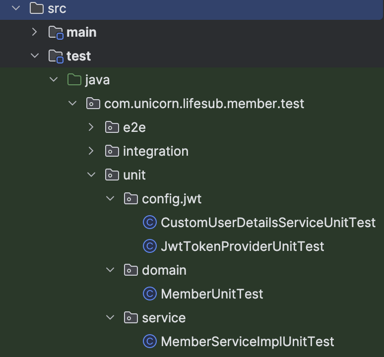
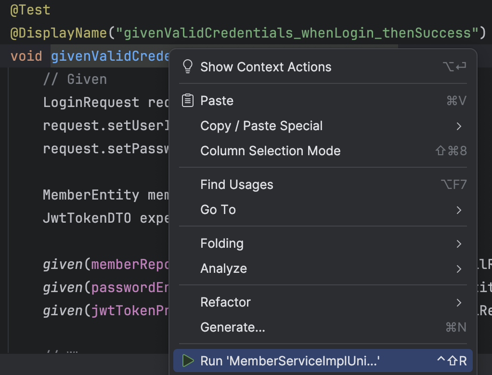
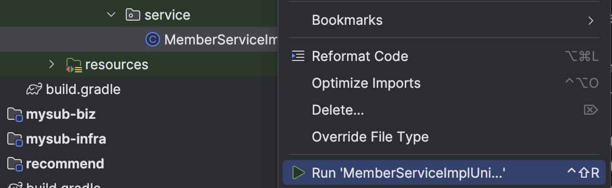

# Test code 작성 가이드 

## 목차
- [Test code 작성 가이드](#test-code-작성-가이드)
  - [목차](#목차)
  - [사전준비](#사전준비)
  - [테스트 코드 작성](#테스트-코드-작성)
    - [단위 테스트 코드 작성](#단위-테스트-코드-작성)
    - [통합 테스트 코드 작성](#통합-테스트-코드-작성)
    - [E2E 테스트 코드 작성](#e2e-테스트-코드-작성)
  - [테스트 코드 이해](#테스트-코드-이해)

---

## 사전준비  
- Knowledge에 아래 파일 추가   
  - TDD이해.txt  
  - TestContainer 설정 가이드.txt  
  - MergedSource.java   
    아래 명령으로 전체 소스를 합쳐서 올림  
    ```
    cd ~/workspace
    python mergesrc.py
    # 소스 디렉토리명 (기본값: ): lifesub
    ```
  
- instruction에 테스트 코드 작성 가이드 추가  
  'instruction_testcode.txt'의 내용을 instruction에 추가합니다.  

| [Top](#목차) |

---

## 테스트 코드 작성  
단위 테스트 코드 결과 예제는 lifesub의 member서비스에 있습니다.  
https://github.com/cna-bootcamp/lifesub.git  

### 단위 테스트 코드 작성
- 테스트 코드 작성 요청  
  아래 프롬프트로 단위 테스트 코드 작성을 Claude에 요청 합니다.  
  ```
  tu: {service}에 대한 단위 테스트 코드를 작성해 주세요.
  ```
  예시)  
  ```
  tu: {member}에 대한 단위 테스트 코드를 작성해 주세요.
  ```  
  
  개선이 필요할 수 있으므로 아래 프롬프트로 검토를 요청합니다.   
  ``` 
  o: instruction의 단위 테스트 가이드라인을 꼼꼼히 보고 잘못된 부분이나 누락된 부분이 있는지 검토해 주세요.
  ```
- 테스트 코드 작성  
  결과 코드를 복사하여 테스트 코드를 작성합니다.  
  예시)
    

- 테스트 코드 개선/완성  
  컴파일 에러가 나는 클래스가 있으면 클로딩하여 개선/완성 합니다.  

- 테스트 코드 실행 및 버그 픽스  
  테스트할 메소드를 선택하고 우측 마우스 메뉴에서 'Run ...' 메뉴로 실행합니다.  
    

  클래스 전체를 동일한 방법으로 실행할 수도 있습니다.   
    

  테스트가 실패하면 클로딩을 통해 버그 픽스 합니다.  

### 통합 테스트 코드 작성 
- 테스트 코드 작성 요청  
  아래 프롬프트로 단위 테스트 코드 작성을 Claude에 요청 합니다.  
  ```
  tu: {service}에 대한 통합 테스트 코드를 작성해 주세요.
  ```
  예시)  
  ```
  tu: {member}에 대한 통합 테스트 코드를 작성해 주세요.
  ```  
  
  개선이 필요할 수 있으므로 아래 프롬프트로 검토를 요청합니다.   
  ``` 
  o: instruction의 통합 테스트 가이드라인을 꼼꼼히 보고 잘못된 부분이나 누락된 부분이 있는지 검토해 주세요.
  ```
- 테스트 코드 작성  
  결과 코드를 복사하여 테스트 코드를 작성합니다.  
  
- 테스트 코드 개선/완성  
  컴파일 에러가 나는 클래스가 있으면 클로딩하여 개선/완성 합니다.  

- 테스트 코드 실행 및 버그 픽스  
  - 테스트할 메소드를 선택하고 우측 마우스 메뉴에서 'Run ...' 메뉴로 실행합니다.  
  - 클래스 전체를 동일한 방법으로 실행할 수도 있습니다.   
  - 테스트가 실패하면 클로딩을 통해 버그 픽스 합니다. 

### E2E 테스트 코드 작성 
- 테스트 코드 작성 요청  
  아래 프롬프트로 단위 테스트 코드 작성을 Claude에 요청 합니다.  
  ```
  tu: {service}에 대한 E2E 테스트 코드를 작성해 주세요.
  ```
  예시)  
  ```
  tu: {member}에 대한 E2E 테스트 코드를 작성해 주세요.
  ```  
  
  개선이 필요할 수 있으므로 아래 프롬프트로 검토를 요청합니다.   
  ``` 
  o: instruction의 E2E 테스트 가이드라인을 꼼꼼히 보고 잘못된 부분이나 누락된 부분이 있는지 검토해 주세요.
  ```
- 테스트 코드 작성  
  결과 코드를 복사하여 테스트 코드를 작성합니다.  
  
- 테스트 코드 개선/완성  
  컴파일 에러가 나는 클래스가 있으면 클로딩하여 개선/완성 합니다.  

- 테스트 코드 실행 및 버그 픽스  
  - 테스트할 메소드를 선택하고 우측 마우스 메뉴에서 'Run ...' 메뉴로 실행합니다.  
  - 클래스 전체를 동일한 방법으로 실행할 수도 있습니다.   
  - 테스트가 실패하면 클로딩을 통해 버그 픽스 합니다. 

| [Top](#목차) |

---

## 테스트 코드 이해   
아래 Mockito 라이브러리 자료를 갖고 테스트 코드를 이해해 봅니다.   
https://drive.google.com/file/d/1HFOTmPe_MPTdJeA3mScZLRX9tVQx7b98/view?usp=drive_link

잘 이해가 안되는 부분은 클로딩 합니다.  


