# Kubernetes 기초  

개발한 구독관리 서비스를 컨테이너 이미지로 빌드하고 AKS에 배포하면서 쿠버네티스에 대해 이해합니다.  

## 목차
- [Kubernetes 기초](#kubernetes-기초)
  - [목차](#목차)
  - [ingress controller 추가](#ingress-controller-추가)
  - [사전준비](#사전준비)
  - [네임스페이스 생성](#네임스페이스-생성)
  - [Database 설치](#database-설치)
  - [Backend Application 실행파일 빌드](#backend-application-실행파일-빌드)
  - [컨테이너 이미지 빌드](#컨테이너-이미지-빌드)
    - [Backend Application](#backend-application)
    - [Front Application](#front-application)
  - [컨테이너 이미지 푸시](#컨테이너-이미지-푸시)
    - [ACR로그인](#acr로그인)
    - [Backend Application 이미지 푸시](#backend-application-이미지-푸시)
    - [Frontend Application 이미지 푸시](#frontend-application-이미지-푸시)
  - [Kubernetes Manifest 준비](#kubernetes-manifest-준비)
    - [ALLOWED\_ORIGINS값 셋팅](#allowed_origins값-셋팅)
    - [매니페스트 이해](#매니페스트-이해)
      - [**1.Ingress**](#1ingress)
      - [**2.Service**](#2service)
      - [**3.Workload Controller**](#3workload-controller)
      - [**4.ConfigMap과 Secret**](#4configmap과-secret)
      - [**5.PV/PVC**](#5pvpvc)
  - [Manifest 점검 및 실행](#manifest-점검-및-실행)
  - [manifest 실행](#manifest-실행)
  - [정상 배포 확인](#정상-배포-확인)
  - [테스트](#테스트)

---

## ingress controller 추가
쿠버네티스 설치 시 Ingress Controller가 기본으로 설치 안되기 때문에 먼저 그거부터 설치해야 합니다.  
Ingress Controller 중 가장 많이 사용하는 nginx ingress controller를 추가합니다.  

작업 디렉토리를 먼저 만듭니다.  
```
mkdir -p ~/install/ingress-controller && cd ~/install/ingress-controller 
```

helm으로 설치할 겁니다.  
따라서 helm repository 부터 추가해야겠죠?  
```
helm repo add ingress-nginx https://kubernetes.github.io/ingress-nginx
helm repo update 
```

아래 내용으로 ingress-values.yaml 파일을 만듭니다.  
appProtocol 옵션을 비활성해야 제대로 생성이 됩니다.  
```
controller:
  replicaCount: 1
  service:
    annotations:
      service.beta.kubernetes.io/azure-load-balancer-health-probe-request-path: /healthz
    loadBalancerIP: ""
    
    #해당 포트가 어떤 애플리케이션 프로토콜을 사용하는지 명시적으로 지정하는 옵션 비활성화
    #targetPort를 named port("http", "https")로 매핑하려고 시도해서 
    #Ingress Nginx Controller pod의 container port는 숫자(80, 443)로 정의되어 있어서 매핑이 실패 
    appProtocol: false  
    
  config:
    use-forwarded-headers: "true"
  resources:
    requests:
      cpu: 100m
      memory: 128Mi
    limits:
      cpu: 500m
      memory: 512Mi

```

ingress-basic 네임 스페이스에 설치 합니다.    
```
helm upgrade -i ingress-nginx -f ingress-values.yaml \
-n ingress-basic --create-namespace ingress-nginx/ingress-nginx 
```

제대로 생성되었는지 체크해 봅니다.   
```
k get svc -n ingress-basic
k get po -n ingress-basic
```

잠깐 ingress controller가 어떻게 외부의 요청을 내부로 연결할까요?  
ingress controller 파드는 준실시간으로 ingress object들의 설정을 읽어 내부의 nginx.conf파일에 업데이트 합니다.  
외부에서는 ingress-nginx-controller의 L/B IP로 접근합니다.  
이 트래픽 요청의 Host와 경로에 따라 적절한 서비스 오브젝트로 proxying합니다.    
결론적으로 외부의 트래픽을 내부로 전달하는 것은 인그레스 오브젝트가 아니라 인그레스 컨트롤러 파드드인것입니다.  
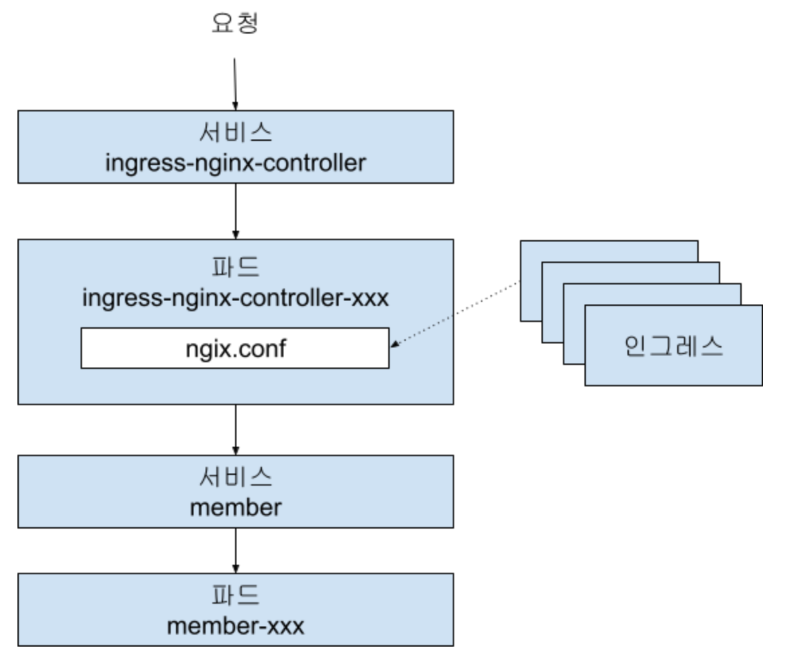

내친김에 ingress controller pod의 nginx.conf 내용도 볼까요? 
아직 ingress 오브젝트를 만들지 않았기 때문에 지금은 실습 못하지만,  
이 실습이 완료된 후에 한번 직접 확인해 보십시오.  
```
k get po -n ingress-basic

k exec -it {ingress controller pod}  -n ingress-basic -- bash
ingress-nginx-controller-5d9dcdb7b8-dx65z:/etc/nginx$ cat nginx.conf | more
```

스페이스를 눌러 내려가다 보면 아래 예와 같은 설정이 있는걸 확인할 수 있을겁니다.  
보시면 아시겠죠? ingress 오브젝트 'backend-ingress'의 설정이 그대로 반영되어 있습니다.   
```
## start server _
server {
    ...
    location ~* "^/recommend(/|$)(.*)" {

        set $namespace      "${ID}-lifesub-ns";
        set $ingress_name   "backend-ingress";
        set $service_name   "recommend";
        set $service_port   "80";
        set $location_path  "/recommend(/|${literal_dollar})(.*)";
        ...
 
        # Custom Response Headers
        rewrite "(?i)/recommend(/|$)(.*)" /$2 break;
        proxy_pass http://upstream_balancer;
    }
    ...
}
```

| [Top](#목차) |

---

## 사전준비 

1.lifesub-ns의 리소스 삭제  
AKS의 자원이 부족할 수 있으므로 이전에 실습한 lifesub-ns의 모든 리소스부터 정리하겠습니다.    
```
helm delete member mysub recommend -n lifesub-ns
k delete pvc --all -n lifesub-ns
k delete deploy --all -n lifesub-ns
k delete cm --all -n lifesub-ns
k delete secret --all -n lifesub-ns
k delete ns lifesub-ns
```

2.실행을 위한 전역변수 셋팅  
```
export ID={본인ID}

```

3.실습을 위한 소스 클론  
```
cd ~/workspace
git clone https://github.com/cna-bootcamp/lifesub.git -b k8s
git clone https://github.com/cna-bootcamp/lifesub-web.git
```
만약 기존에 있다면 지우거나 옮기시고 하십시오.  

| [Top](#목차) |

---

## 네임스페이스 생성
```bash
k create ns ${ID}-lifesub-ns 2>/dev/null || true
kubens {ID}-lifesub-ns
```

## Database 설치
각 백엔드 서비스를 위한 PostgreSQL DB를 설치합니다.  
역시 Helm 차트로 설치합니다.  

Helm repository를 추가하고요. 
```
helm repo add bitnami https://charts.bitnami.com/bitnami
helm repo update
```

미리 만들어진 shell파일을 이용하여 설치합니다.  
```
cd ~/workspace/lifesub
chmod +x deployment/database/deploy_db.sh
./deployment/database/deploy_db.sh ${ID}-lifesub-ns
```

파드와 서비스가 잘 생성되었는지 확인합니다.  
```
k get po 
k get svc
```

| [Top](#목차) |

---

## Backend Application 실행파일 빌드    

```bash
# lifesub 디렉토리에서 수행
cd ~/workspace/lifesub

# member 서비스
./gradlew :member:clean :member:build -x test

# mysub 서비스
./gradlew :mysub-infra:clean :mysub-infra:build -x test

# recommend 서비스
./gradlew :recommend:clean :recommend:build -x test
```

## 컨테이너 이미지 빌드  
### Backend Application
```bash
# lifesub 디렉토리에서 수행
cd ~/workspace/lifesub

# member 서비스
docker build \
  --build-arg BUILD_LIB_DIR="member/build/libs" \
  --build-arg ARTIFACTORY_FILE="member.jar" \
  -f deployment/Dockerfile \
  -t ${ID}cr.azurecr.io/lifesub/member:1.0.0 .

# mysub 서비스
docker build \
  --build-arg BUILD_LIB_DIR="mysub-infra/build/libs" \
  --build-arg ARTIFACTORY_FILE="mysub.jar" \
  -f deployment/Dockerfile \
  -t ${ID}cr.azurecr.io/lifesub/mysub:1.0.0 .

# recommend 서비스
docker build \
  --build-arg BUILD_LIB_DIR="recommend/build/libs" \
  --build-arg ARTIFACTORY_FILE="recommend.jar" \
  -f deployment/Dockerfile \
  -t ${ID}cr.azurecr.io/lifesub/recommend:1.0.0 .
```

### Front Application 
아시다시피 프론트엔드는 클라이언트 디바이스(브라우저나 모바일 단말기)에서 백엔드를 호출합니다.  
그래서 각 백엔드 서비스의 호출 주소를 지정해 줘야 합니다.   
가장 간단한 방법은 백엔드 서비스를 LoadBalancer 타입으로 만들어 External IP를 지정하면 되겠죠?   
  
좀 더 세련된 방법이 없을까요?   
Ingress를 이용하는 방법이 더 나은 방법입니다.  왜일까요?   
백엔드 서비스를 외부에 직접 노출하지 않고 Ingress를 통해서 연결하니 확장성도 좋고 보안 측면에서도 더 좋기 때문입니다.     
  
혹시 프론트엔드도 파드이고 백엔드도 파드이니 백엔드의 서비스 오브젝트를 통해 통신하면 되지않아? 
라고 생각하시는 분이 있을 수 있습니다.   
안됩니다.  왜냐하면 프론트엔드와 백엔드가 서버 TO 서버 통신이 아니라 클라이언트 TO 서버 통신이기 때문입니다.   
'클라이언트 디바이스 -> Proxy서버 -> 백엔드 서비스'의 구조로 바꿔줘야 가능합니다.  
Proxy서버의 역할을 하는게 결국 Ingress Controller입니다.     

그래서 전략은 이렇습니다.  
- 프론트엔드는 Ingress Controller Service(ingress-nginx-controller)의 L/B IP를 호출   
- 호출 시 경로를 다르게 함. 예) http://{Ingress Controller Service L/B IP}/member   
- Ingress로 각 경로마다 Rewriting하여 각 백엔드의 서비스 객체를 연결. 예) /member/api/... -> http://member/api/...  
  
그럼 이 전략대로 각 백엔드 서비스의 주소를 셋팅하여 프론트엔드 이미지를 만들어 봅시다.   
아래와 같이 하면 됩니다.  
```bash
# lifesub-web 디렉토리에서 수행
cd ~/workspace/lifesub-web

ingress_host=$(kubectl get svc ingress-nginx-controller -n ingress-basic -o jsonpath='{.status.loadBalancer.ingress[0].ip}' 2>/dev/null || true)
echo "Ingress Host: ${ingress_host}"  
docker build \
  --build-arg PROJECT_FOLDER="." \
  --build-arg REACT_APP_MEMBER_URL="http://${ingress_host}/member" \
  --build-arg REACT_APP_MYSUB_URL="http://${ingress_host}/mysub" \
  --build-arg REACT_APP_RECOMMEND_URL="http://${ingress_host}/recommend" \
  --build-arg BUILD_FOLDER="deployment" \
  --build-arg EXPORT_PORT="18080" \
  -f deployment/Dockerfile-lifesub-web \
  -t ${ID}cr.azurecr.io/lifesub/lifesub-web:1.0.0 .
```

| [Top](#목차) |

---

## 컨테이너 이미지 푸시  
### ACR로그인 
먼저 ACR 로그인 정보를 확인하고 로그인 합니다.  
```bash
# ACR 로그인
ACR_NAME="${ID}cr"
ACR_SERVER="${ACR_NAME}.azurecr.io"
ACR_USERNAME=$(az acr credential show -n ${ACR_NAME} --query "username" -o tsv)
ACR_PASSWORD=$(az acr credential show -n ${ACR_NAME} --query "passwords[0].value" -o tsv)

# Docker 로그인
echo ${ACR_PASSWORD} | docker login ${ACR_SERVER} -u ${ACR_USERNAME} --password-stdin
```

### Backend Application 이미지 푸시  
```bash
# member 서비스
docker push ${ID}cr.azurecr.io/lifesub/member:1.0.0

# mysub 서비스
docker push ${ID}cr.azurecr.io/lifesub/mysub:1.0.0

# recommend 서비스
docker push ${ID}cr.azurecr.io/lifesub/recommend:1.0.0
```

### Frontend Application 이미지 푸시  

```
docker push ${ID}cr.azurecr.io/lifesub/lifesub-web:1.0.0
```

| [Top](#목차) |

---

## Kubernetes Manifest 준비  
쿠버네티스 매니페스트 파일들은 이미 deployment 디렉토리 하위에 생성되어 있습니다.  
백엔드는 IntelliJ에서 오픈하여 확인하고, 프론트엔드는 VSCode에서 오픈하여 확인해 보십시오.   
각 매니페스트에 대한 설명은 조금 이따 하고 골치 아픈것 먼저 해결합시다.  
  
### ALLOWED_ORIGINS값 셋팅  
바로 CORS 설정을 위한 환경변수 'ALLOWED_ORIGINS' 셋팅입니다.   
메니페스트 'lifesub/deployment/manifest/configmaps/common-config.yaml'에 정의되어 있습니다.  
이 변수에는 프론트엔드의 주소가 들어가야 합니다.  
프론테엔드의 주소는 프론트엔드 서비스 객체의 L/B IP겠죠?   
즉, 매니페스트를 보면 lifesub-web이라는 서비스 객체의 External IP입니다.  
이 IP를 알려면 lifesub-web 서비스 객체를 배포할 수 밖에 없습니다.  
그리고 External IP를 구해서 'common-config.yaml'의 ALLOWED_ORIGINS값을 바꿔줘야 합니다.     
  
아래는 이 과정을 자동으로 처리하는 명령들입니다.    
```
cd ~/workspace
# lifesub-web service 생성
kubectl apply -f lifesub-web/deployment/manifest/services/lifesub-web-service.yaml

# lifesub-web의 External IP가 할당될 때까지 대기
echo "Waiting for LoadBalancer IP..."
while [ -z "$web_host" ]; do
  web_host=$(kubectl get svc lifesub-web -o jsonpath='{.status.loadBalancer.ingress[0].ip}' 2>/dev/null)
  if [ -z "$web_host" ]; then
    echo -n "."
    sleep 2
  fi
done
echo "LoadBalancer IP: ${web_host}"

cat > lifesub/deployment/manifest/configmaps/common-config.yaml << EOF
apiVersion: v1
kind: ConfigMap
metadata:
  name: common-config
data:
  JPA_DDL_AUTO: update
  JPA_SHOW_SQL: "true"
  ALLOWED_ORIGINS: "http://localhost:18080,http://localhost:18081,http://${web_host}"
EOF

# 반영 확인
echo -e "\nVerifying configuration:"
echo "Web Service IP: ${web_host}"
echo -n "ALLOWED_ORIGINS: "
grep "ALLOWED_ORIGINS" lifesub/deployment/manifest/configmaps/common-config.yaml
```

### 매니페스트 이해
쿠버네티스 주요 리소스의 흐름 기억하시죠?  
Ingress -> Service -> Pod (ConfigMap, Secret, PVC 마운트)   
그리고 Pod를 관리하는 5가지 종류의 Workload Controller가 있습니다.  
Deployment, StatefulSet, DaemonSet, Job, CronJob이 그것이죠.   
  
Backend 매니페스트  
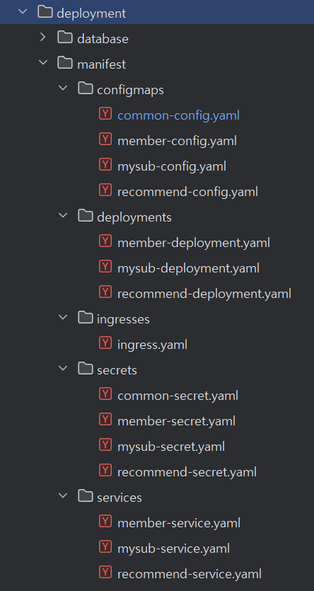  

#### **1.Ingress**  
path '/member(/|$)(.*)'에서 '(/|$)'부분이 '$1'이고 '(.*)'부분이 '$2'가 됩니다.  
'nginx.ingress.kubernetes.io/rewrite-target'에 의해서 'member/'부분은 사라지고   
그 뒤의 값으로 rewriting 됩니다.   
예) /member/api/auth/login -> http://member:80/api/auth/login    
```
apiVersion: networking.k8s.io/v1
kind: Ingress
metadata:
  name: backend-ingress
  annotations:
    kubernetes.io/ingress.class: nginx
    nginx.ingress.kubernetes.io/rewrite-target: /$2
    nginx.ingress.kubernetes.io/use-regex: "true"
spec:
  ingressClassName: nginx
  rules:
    - http:
        paths:
          - path: /member(/|$)(.*)
            pathType: ImplementationSpecific
            backend:
              service:
                name: member
                port:
                  number: 80
```
더 자세한 정보를 원하시면 [서비스 로드 밸런서 인그레스](https://happycloud-lee.tistory.com/254)을 참조하세요.      

| [Top](#목차) |

---

#### **2.Service**   
1)로드밸런싱   
selector에 정의한 대로 'app=member' Label으로 생성된 Pod를 로드밸런싱 합니다.  
Service객체는 '80'으로 요청을 받아 대상 Pod의 '8081'포트로 바인딩합니다.  
Pod내 애플리케이션이 로딩되는 포트를 targetPort로 지정해야 합니다.  
```
apiVersion: v1
kind: Service
metadata:
  name: member
spec:
  selector:
    app: member
  ports:
    - port: 80
      targetPort: 8081
  type: ClusterIP
```
    
2)Service 유형  
Service 리소스의 'type'은 3가지가 있습니다.  
- ClusterIP:   
  - 내부IP와 서비스 포트만 부여됨    
  - k8s 클러스터 내부에서만 접근 가능: http://{Service명}.{네임스페이스}.svc.cluster.local:{Service 포트}로 호출    
  - 동일 네임스페이스의 서비스는 http://{Service명}:{Service 포트}로 호출 가능    
- NodePort: 
  - k8s 클러스터 외부에서 접근할 수 있는 포트가 생성됨(3000~32767중 빈 포트 할당)   
  - k8s 클러스터 내부에서 접근 주소: ClusterIP와 동일   
  - k8s 클러스터 외부에서 접근 주소: http://{k8s 노드 Public IP}:{Node Port}. k8s노드는 아무거나 상관없음   
  - NodePort는 spec.ports.nodePort로 고정 가능함  
  - k8s 클러스터가 외부에 노출되지 않은 경우는 Bastion서버 IP를 사용하고 Bastion IP에 포트 Proxying 해야 함  
- LoadBalancer:  
  - k8s 클러스터 외부에서 접근할 수 있는 Public IP가 생성됨  
  - Major CSP(Cloud Service Provider)의 K8s솔루션(AKS, EKS, GKS등)에서만 지원됨  
- ExternalName:  
  - k8s 외부로의 프락시 역할 수행  
  - spec하위에 type과 externalName(프로토콜 없이 FQDN만 등록)만 지정. 예) kos.ktds.com:18080
  
3)기타 유용한 정보
- 'spec.sessionAffinity: ClientIP': 한번 붙은 Pod로 계속 로드밸런싱 하게 함  
- 헤드리스(Headless) 서비스:  
  - 로드밸런싱이 필요하지 않은 Pod를 연결하기 위한 특수한 서비스 객체  
  - 애플리케이션에서 StatefulSet으로 배포한 DB Pod 접근 시 자신과 동일한 노드에 배포된 DB Pod 직접 접근 시 사용  
  - 또는, 요청자 애플리케이션에서 직접 로드밸런싱을 할 때도 사용(헤드리스 서비스 호출하면 대상 Pod 주소가 리턴됨)     
- ClusterIP 서비스를 외부에 노출하기: spec.externalIPs에 k8s 노드의 Public IP나 Bastion Public IP를 지정하면 됨  
- 엔드포인트(End Point) 리소스  
  - 서비스 객체가 생성되면 자동으로 생성되는 객체(k get ep 명령으로 봄)    
  - 대상 Pod의 주소(End Point)를 볼 수 있음    
  - Selector가 없는 헤드리스 서비스를 만들고 직접 엔드포인트 객체를 만들어서 특정 Pod로 연결되게 할 수도 있음  

직접 실습까지 하고 싶으면 [파드 로드 밸런서 서비스](https://happycloud-lee.tistory.com/253)를 참조하세요.   

| [Top](#목차) |

---
   
#### **3.Workload Controller**   
**1)워크로드 컨트롤러의 유형**   
   
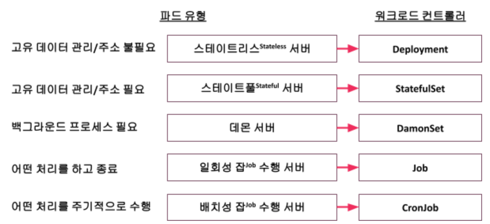  
  
Database는 자기가 CRUD해야할 데이터 저장소에 대한 정보를 갖고 있어야 하므로 StatefulSet으로 배포합니다.   
여기서 데이터 저장소에 대한 정보는 PVC(Persistent Volume Claim)으로 정의 합니다.    
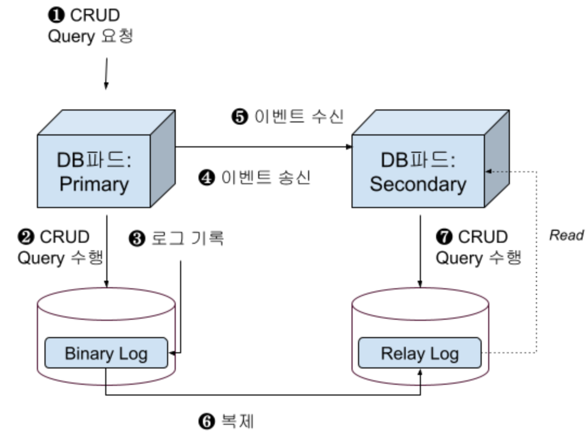  
  
**2)워크로드 컨트롤러의 구조**     
워크로드는 항목이 많기 때문에 더 자세한 정보는 [파드 실행 및 통제를 위한 워크로드 컨트롤러](https://happycloud-lee.tistory.com/252)을 참조 하세요.   
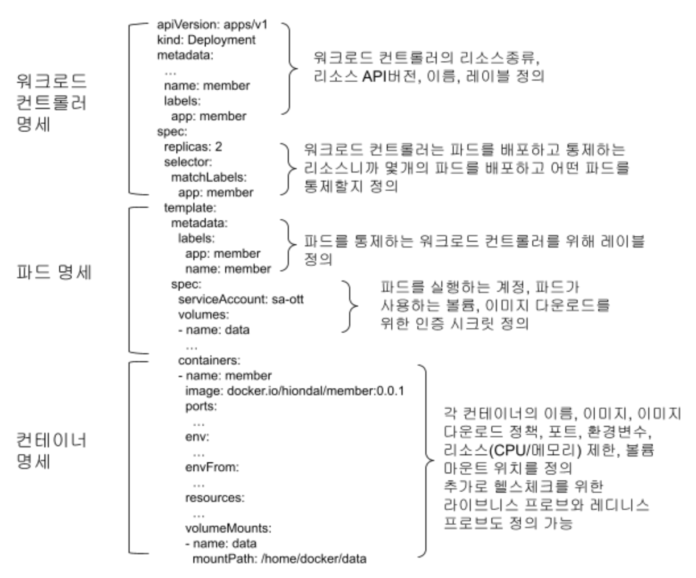  
    
**3)Deployment와 StatefulSet의 차이점**     
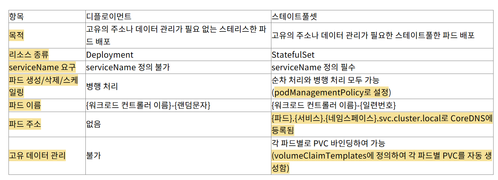  
      

**4)ImagePullPolicy**: Always-로컬에 있어도 항상 레지스트리에서 다시 Pull함, IfNotPresent: 로컬에 없을때만 Pull함   
   
**5)imagePullSecrets**: 이미지 레지스트리의 인증 정보를 담고 있는 시크릿 객체 지정   
   
**6)파드스케줄링 방법**: 파드가 배포될 노드를 지정하는 방법입니다.   
'어피니티'가 붙은 방법들은 좀 복잡합니다.  
[파드 실행 및 통제를 위한 워크로드 컨트롤러](https://happycloud-lee.tistory.com/252)을 참조 하세요.   
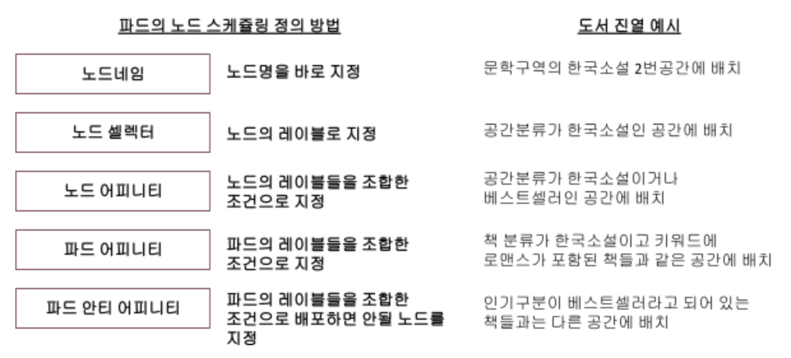  

**7)CPU/Memory 초기값/최대값 정의**   
spec.template.spec.containers 항목 밑에 각 컨테이너별로 지정합니다.   
컨테이너의 수직 스케일링을 정의하는 것입니다.   
컨테이너의 최대 리소스 허용치를 지정함으로써 다른 컨테이너와의 자원 경합을 방지 합니다.   
만약 HPA(Horizontal Pod AutoScaler)가 적용되어 있다면 이 허용치를 기준으로   
수평 스케일링이 수행됩니다.     
```
resources:
requests:
    cpu: 256m
    memory: 256Mi
limits:
    cpu: 1024m
    memory: 1024Mi
```
    
**8)ConfigMap과 Secret 동적 주입 **      
spec.template.spec.containers 항목 밑에 각 컨테이너별로 지정합니다.   
아래와 같이 외부의 ConfigMap객체와 Secret객체를 지정하면 됩니다.   
```
envFrom:
- configMapRef:
    name: common-config
- configMapRef:
    name: member-config
- secretRef:
    name: common-secret
- secretRef:
    name: member-secret
```

직접 지정하고 싶으면 'env'항목 밑에 지정하면 됩니다.  
```
env:
- name: MONGO_INITDB_ROOT_USERNAME
  value: $MONGODB_USER
- name: MONGO_INITDB_DATABASE
  value: "member"
```
    
**9)헬스체크**   
spec.template.spec.containers 항목 밑에 각 컨테이너별로 지정합니다.  
   

```
startupProbe:
  httpGet:
    path: /actuator/health
    port: 8081
  initialDelaySeconds: 30
  periodSeconds: 10
  failureThreshold: 30

readinessProbe:
  httpGet:
    path: /actuator/health/readiness
    port: 8081
  initialDelaySeconds: 10
  periodSeconds: 5

livenessProbe:
  httpGet:
    path: /actuator/health/liveness
    port: 8081
  initialDelaySeconds: 60
  periodSeconds: 15
```
9.1)Health 체크 방법     
- common: 리눅스 명령어 이용   
- httpGet: HTTP로 컨테이너 안의 웹 주소를 호출하여 체크    
- tcp: 컨테이너 포트로 접속을 체크하는 방법    
     
9.2)Health 체크 파라미터    
- initialDelaySeconds: 최초 헬스 체크 시작 전에 기다리는 시간    
- periodSeconds: 헬스 체크 시작 후 체크 주기   
- timeoutSeconds: 응답 시간 제한    
- failureThreshold: 몇 번까지 실패 시 최종 실패로 간주할 것인가 ?    
- successThreshold: 몇 번까지 성공 시 최종 성공으로 간주할 것인가 ?   
   
9.3)terminationGracePeriodSeconds: 안전한 파드 종료를 위한 여유시간 지정(기본:30초)    

9.4)Spring Boot Actuator 라이브러리를 이용한 헥스체크 엔드 포인트(/actuator/health[/liveness, readiness]) 생성   
최상위 build.gralde에 'Actuator'라이브러리를 추가합니다.   
```
// Actuator 추가
implementation 'org.springframework.boot:spring-boot-starter-actuator'
```   
각 서비스(member, mysub-infra, recommend)의 application.yml에 설정을 추가하여 End point를 생성합니다.   
```
# Actuator 설정
management:
  endpoints:
    web:
      exposure:
        include: health,info,metrics,prometheus
  endpoint:
    health:
      show-details: always
      probes:
        enabled: true
  health:
    livenessState:
      enabled: true
    readinessState:
      enabled: true
```
   
직접 실습까지 해보고 싶으면 [헬스 체크를 위한 스타트업 프로브, 라이브니스 프로브, 레디니스 프로브](https://happycloud-lee.tistory.com/257)를 참조하세요.      

   
**10)DaemonSet, Job, CronJob**     
자주 사용되는 워크로드 컨트롤러는 아닙니다.   
[파드 실행 및 통제를 위한 워크로드 컨트롤러](https://happycloud-lee.tistory.com/252)을 참조 하세요.   

| [Top](#목차) |

---

#### **4.ConfigMap과 Secret**       

ConfigMap과 Secret의 생성과 사용 방식 차이는 아래와 같습니다.      
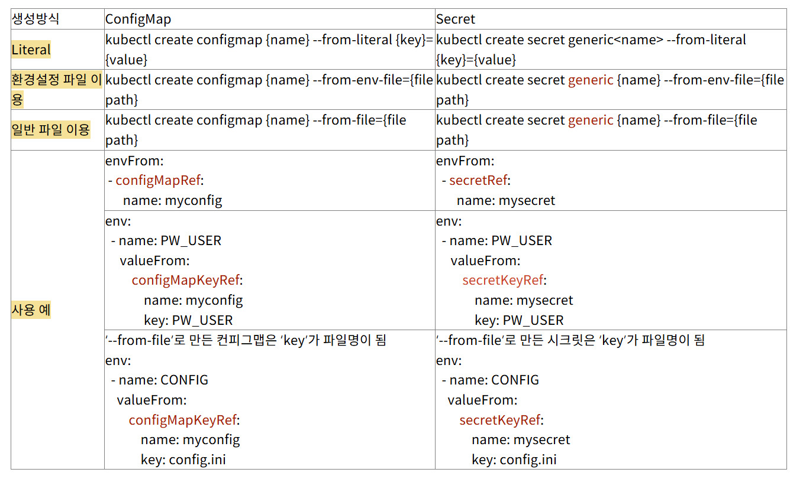   

- 환경설정 파일 이용 방식은 파일에 키와 밸류로 구성된 환경변수들을 정의하고 그 파일을 이용하여 컨피그맵이나 시크릿을 만드는 방식입니다.   
  환경변수 이름에는 언더바를 쓰시는게 제일 안전합니다.  
- 파일 내용을 컨피그맵으로 만들어 파드 안에 파일로 마운트 시켜야 하는 경우 '일반 파일 이용방식'을 사용합니다.  
  환경변수명은 파일명이 되고 그 내용은 파일의 내용으로 생성됩니다.   
  ```
  k create cm cm3 --from-file=cm.conf --from-file=imgreg.conf
  k describe cm cm3
  …
  Data
  ====
  cm.conf:
  ----
  {
    name: "busybox"
    description: "test config"
  }
  imgreg.conf:
  ----
  registry=docker.io
  organization=hiondal
  repo=member
  ```
  

**1)볼륨으로 마운트하기**   
위 표의 사용 예와 같이 파드에 환경변수를 주입하는 방법 외에 파드 내 특정 볼륨(디렉토리)에 마운트 할 수도 있습니다.   
이러한 볼륨 마운트를 하는 이유는 볼륨 마운트된 **컨피그맵과 시크릿의 내용이 변경되면 파드 안에도 동적으로 반영** 하기 위해서입니다.    
반영 시간은 실시간은 아니고 수초 이상 걸립니다.   
이는 파드를 재시작하지 않고도 외부에서 환경설정을 관리하는 좋은 방법입니다.    
    
**2)프로젝티드 볼륨(Projected Volumes)**   
프로젝티드 볼륨이란 동일한 디렉토리 밑으로 여러개의 파드 외부 볼륨을 마운트하는 방법입니다.   
컨피그맵과 시크릿을 프로젝티드 볼륨 방식으로 동일한 디렉토리 밑으로 마운트 할 수 있습니다.  
프로젝티드 볼륨에서 ‘Projected’라는 의미는 동일한 목적으로 관련된 것을 묶었다는 의미로 이해하시면 됩니다.
   
**3)시크릿으로 관리되는 데이터 유형**    
시크릿은 환경변수 생성 뿐 아니라 보안이 필요한 다양한 종류의 데이터를 관리하기 위해서도 사용됩니다.
  
시크릿으로 관리되는 데이터의 종류는 아래와 같습니다.
시크릿을 만들때 각 사용 용도에 맞게 정확한 시크릿 타입을 지정해 주는 것이 좋습니다.
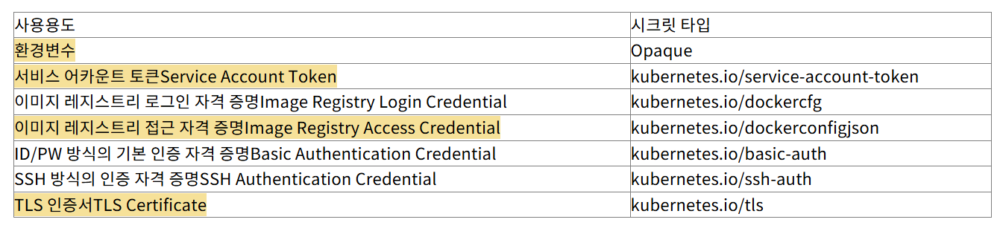   
   

더 자세한 정보와 실습까지 하려면 [환경변수 컨피그맵과 시크릿](https://happycloud-lee.tistory.com/255)을 참조하세요.    

| [Top](#목차) |

---

#### **5.PV/PVC**  

**1)컨테이너에서 외부 볼륨의 필요성**   
컨테이너는 언제라도 사라질 수 있기 때문입니다.   
컨테이너가 사라지면 당연히 내부 볼륨도 없어지고 그럼 소중한 데이터를 잃어 버릴 수 있습니다.   
따라서 **데이터를 안전하게 보존하면서 읽고 쓰기 위해서 외부 볼륨이 필요**한 겁니다.      
   
**2)사용목적별 볼륨 유형**    
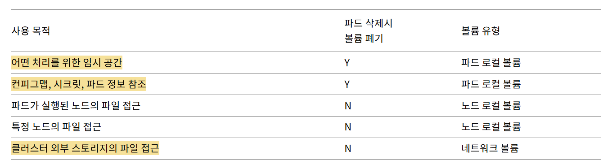  

**2.1) 파드 로컬 볼륨: emptyDir**    
일반적인 사용 예시    
```
...
    spec:
      containers:
      - name: emptydir
        image: hiondal/hello
        imagePullPolicy: IfNotPresent
        volumeMounts:
        - mountPath: /cache
          name: cache
      volumes:
      - name: cache
        emptyDir: {}
```
  
메모리를 볼륨처럼 사용하는 예시   
```
...
    spec:
      containers:
      - name: emptydir
        image: hiondal/hello
        imagePullPolicy: IfNotPresent
        volumeMounts:
        - mountPath: /cache
          name: cache
      volumes:
      - name: cache
        emptyDir:
          medium: Memory
```

**2.2) 파드 로컬 볼륨:컨피그맵과 시크릿을 컨테이너 내부 볼륨으로 마운트**      

```
...
    spec:
      containers:
      - name: emptydir
        volumeMounts:
        - name: myconfig
          mountPath: /home/config
        - name: mysecret
          mountPath: /home/secret/secret.conf
          subPath: secret.conf
      volumes:
      - name: myconfig
        configMap:
          name: cm3
      - name: mysecret
        secret:
          secretName: secret3
```

**2.3) 파드 로컬 볼륨: downwardAPI**   
파드 매니페스트에 정의한 내용을 볼륨으로 마운트하여 사용하는 방식입니다.      

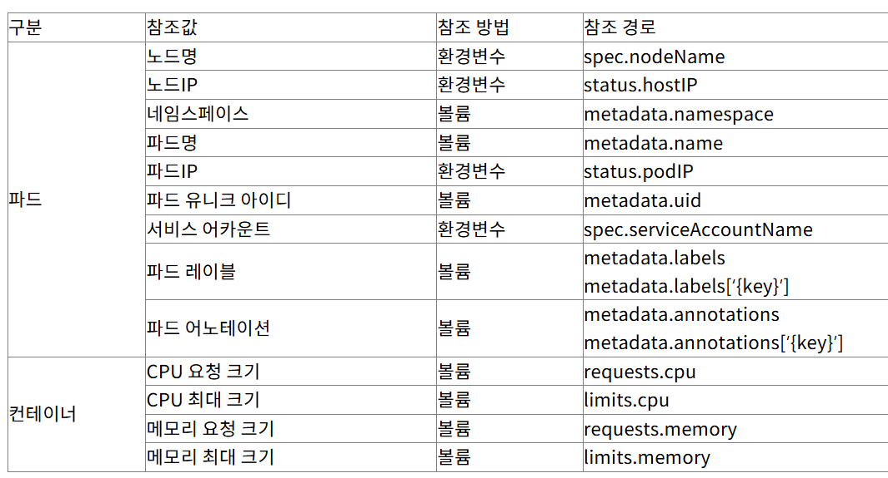 

```
apiVersion: apps/v1
kind: StatefulSet
metadata:
  name: downwardapi
  namespace: ott
spec:
  selector:
    matchLabels:
      app: downwardapi
  replicas: 1
  serviceName: downwardapi
  template:
    metadata:
      labels:
        app: downwardapi
    spec:
      serviceAccount: sa-ott
      containers:
      - name: downwardapi
        image: hiondal/hello
        imagePullPolicy: IfNotPresent
        resources:
          requests:
            cpu: 128m
            memory: 256Mi
          limits:
            cpu: 256m
            memory: 512Mi

        env:
        - name: THIS_NODE_NAME
          valueFrom:
            fieldRef:
              fieldPath: spec.nodeName
        - name: THIS_NODE_IP
          valueFrom:
            fieldRef:
              fieldPath: status.hostIP
        - name: THIS_POD_IP
          valueFrom:
            fieldRef:
              fieldPath: status.podIP
        - name: THIS_SERVICE_ACCOUNT
          valueFrom:
            fieldRef:
              fieldPath: spec.serviceAccountName

        volumeMounts:
        - mountPath: /info/pod
          name: podinfo
        - mountPath: /info/container
          name: containerinfo
      volumes:
      - name: podinfo
        downwardAPI:
          items:
          - path: namespace
            fieldRef:
              fieldPath: metadata.namespace
          - path: podname
            fieldRef:
              fieldPath: metadata.name
          - path: poduid
            fieldRef:
              fieldPath: metadata.uid
          - path: labels
            fieldRef:
              fieldPath: metadata.labels['app']
          - path: annotations
            fieldRef:
              fieldPath: metadata.annotations

      - name: containerinfo
        downwardAPI:
          items:
          - path: "cpu_limit"
            resourceFieldRef:
              containerName: downwardapi
              resource: limits.cpu
              divisor: 1m
          - path: "cpu_request"
            resourceFieldRef:
              containerName: downwardapi
              resource: requests.cpu
              divisor: 1m
          - path: "mem_limit"
            resourceFieldRef:
              containerName: downwardapi
              resource: limits.memory
              divisor: 1Mi
          - path: "mem_request"
            resourceFieldRef:
              containerName: downwardapi
              resource: requests.memory
              divisor: 1Mi
```
  
**2.4) 노드 로컬 스토리지: hostPath**   
```
kind: PersistentVolume
apiVersion: v1
metadata:
  name: ott
  labels:
    service: ott
spec:
  storageClassName: standard
  capacity:
    storage: 1Gi
  accessModes:
  - ReadWriteOnce
  persistentVolumeReclaimPolicy: Delete
  hostPath:
    path: /data/ott
    type: Directory
```

**2.5) 노드 로컬 스토리지: persistentVolumeClaim**     
DB파드는 각 파드가 자신이 사용할 고유한 스토리지가 있어야 합니다.  
이를 위해 StatefulSet 매니페스트에 사용할 PVC를 'persistentVolumeClaim'으로 정의합니다.   
```
…
spec:
  …
  replicas: 2
  …
  template:
    …
    spec:
      serviceAccount: sa-ott
      containers:
        …
        volumeMounts:
        - name: data
          mountPath: /home/docker/data
          readOnly: true
      volumes:
      - name: data
        persistentVolumeClaim:
          claimName: ott
          readOnly: true
```

**2.6) 노드 로컬 볼륨: local 볼륨**    
local볼륨은 자신이 사용할 볼륨이 특정 노드(들)에 있는 경우   
자신 파드가 그 특정 노드(들)에 배포 되도록 할 때 유용 합니다.  
  
아래 파드는 'node-role.kubernetes.io/control-plane' 레이블을 갖고 있는 노드들에 배포됩니다.  
```

…
  persistentVolumeReclaimPolicy: Retain
  local:
    path: /data/ott
  nodeAffinity:
    required:
      nodeSelectorTerms:
      - matchExpressions:
        - key: node-role.kubernetes.io/control-plane
          operator: Exists
```

**2.7) 네트워크 볼륨**    

```
kind: PersistentVolume
apiVersion: v1
metadata:
  name: ott
  labels:
    service: ott
spec:
  storageClassName: standard
  capacity:
    storage: 1Gi
  accessModes:
  - ReadWriteOnce
  persistentVolumeReclaimPolicy: Delete
  nfs:
    server: 10.178.189.25
    path: /data
```

쿠버네티스가 지원하는 네트워크 스토리지 볼륨을 정리하면 아래와 같습니다.  
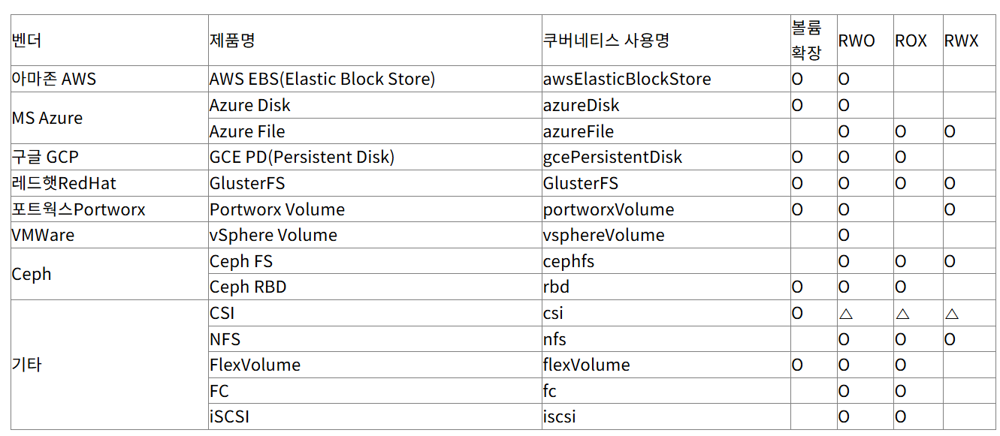    


**3)파드의 볼륨 접근 아키텍처**   
기본적인 원리는 아래와 같이 '마운트'입니다.   
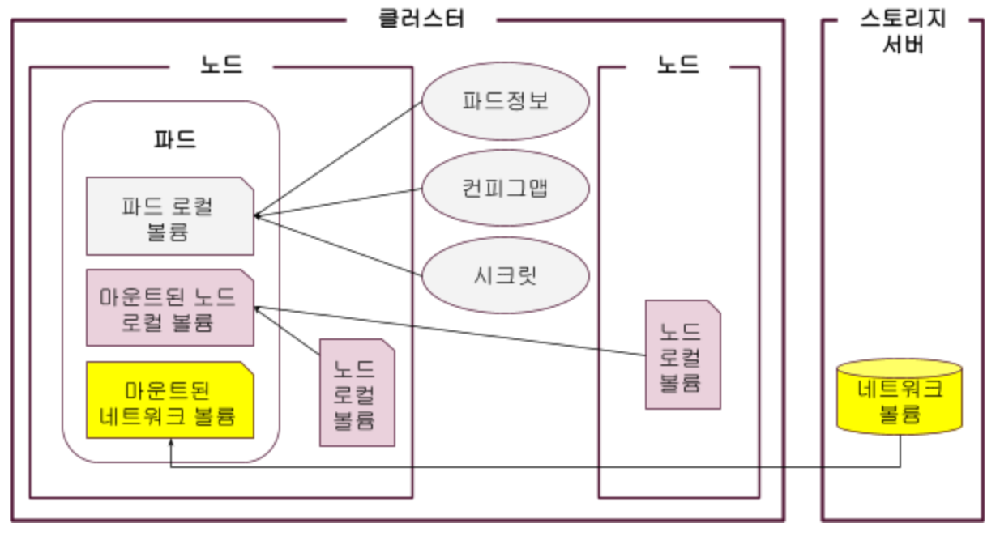  
    
파드와 볼륨간의 Loosely Coupling을 위해 실제 아키텍처는 아래와 같습니다.    
쿠버네티스는 인프라스트럭처와의 느슨한 결합을 위해 퍼시스턴트 볼륨PV(Persistent Volume)/퍼시스턴트 볼륨 클레임PVC(Persistent Volume Claim)와    
CSI(Container Storage Interface)라는 중계자 역할을 만들었습니다.   
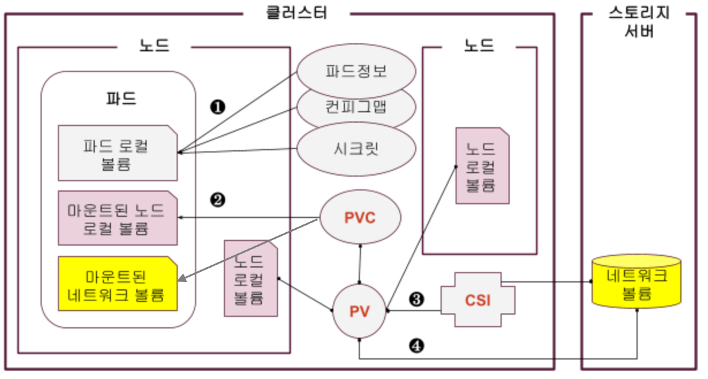   
❶ 파드정보, 컨피그맵, 시크릿은 파드 명세에 정의하여 마운트 합니다.   
❷ 노드 로컬 볼륨과 네트워크 볼륨은 퍼시스턴트볼륨 리소스로 정의하고 퍼시스턴트 볼륨 클레임에 바인딩(연결) 합니다.    
파드 명세에서는 퍼시스턴트 볼륨 클레임만 지정해 주면 연결된 볼륨이 마운트 됩니다.    
❸ 퍼시스턴트 볼륨은 CSI(Container Storage Interface)라는 표준적인 방법으로 정의합니다.   
CSI 표준 명세대로 퍼시스턴트 볼륨을 만들면 스토리지 제품별 CSI 드라이버를 통해 물리적인 네트워크 볼륨을 접근 합니다.   
❹ 스토리지 제품별로 퍼시스턴트 볼륨을 정의하여 볼륨을 접근할 수도 있습니다.   
   
이렇게 되면 파드를 만드는 사람은 퍼시스턴트 볼륨 클레임만 만들면 되고   
퍼시스턴트 볼륨을 만드는 사람은 CSI명세만 알면 됩니다.   
물론 CSI를 이용하지 않을때는 사용하려는 스토리지 제품별로 어떻게 퍼시스턴트 볼륨을 정의해야 하는지 알아야 합니다.   

   
**4)PV의 라이프사이클**    
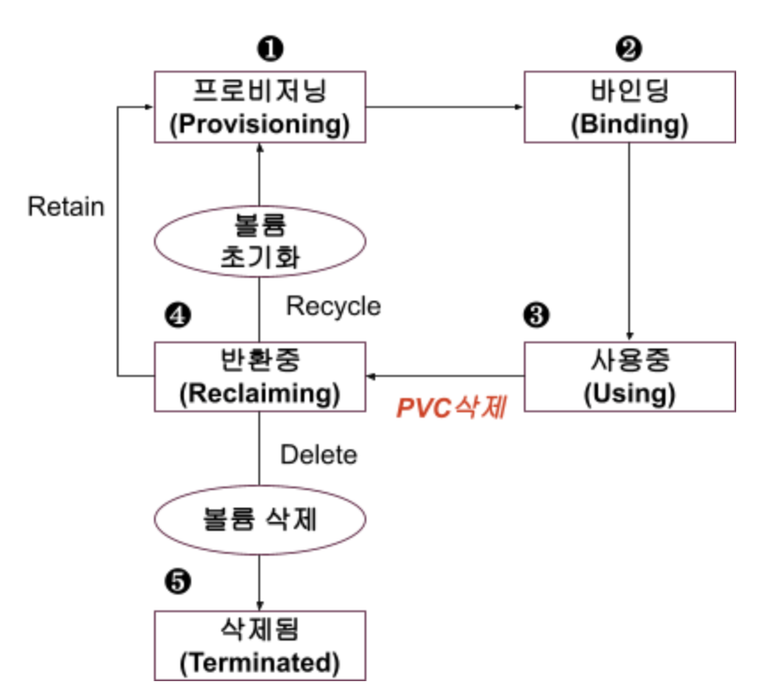   
          
❶ 프로비저닝: 퍼시스턴트 볼륨 오브젝트에 정의된 대로 물리적인 볼륨이 프로비저닝(공급)되는 단계입니다.   
❷ 바인딩: 퍼시스턴트 볼륨 오브젝트가 퍼시스턴트 볼륨 클레임 오브젝트와 연결되는 단계입니다.   
퍼시스턴트 볼륨 오브젝트와 퍼시스턴트 볼륨 클레임 오브젝트는 항상 1:1로 바인딩 되어야 한다는 걸 꼭 기억해 두십시오.    
❸ 사용중: 파드에 볼륨이 마운트 되어 볼륨을 사용하는 단계 입니다.   
파드 명세에 정의된 퍼시스턴트 볼륨 클레임과 바인딩된 퍼시스턴트 볼륨이 마운트 됩니다.    
❹ 반환중: 퍼시스턴트 볼륨 클레임 오브젝트가 삭제 되어 볼륨이 반환 되는 단계입니다.   
퍼시스턴트 볼륨 오브젝트에 정의한 반환 정책Reclaim Policy에 따라서 아래와 같이 다르게 처리 됩니다.   
  - Retain: 퍼시스턴트 볼륨 오브젝트는 프로비저닝 단계로 돌아가고 물리적 볼륨의 데이터도 유지 됩니다.   
    퍼시스턴트 볼륨 클레임과 바인딩 되려면 이전 바인딩 정보를 없애야 합니다.
  - Delete: 퍼시스턴트 볼륨 오브젝트가 자동으로 삭제되고 볼륨 종류에 따라 물리적 볼륨의 데이터도 삭제 됩니다.   
    현재 물리적 볼륨 삭제가 되는 볼륨 종류는 AWS EBS, GCE PD, Azure Disk 입니다.    
  - Recycle: 볼륨 디렉토리 안의 파일들을 모두 삭제하고 프로비저닝 단계로 돌아갑니다.   
    아무 작업 없이도 퍼시스턴트 볼륨 클레임과 바인딩 될 수 있습니다.  이 정책은 향후 hostPath와 NFS 볼륨에서만 지원될 예정입니다.  
Delete와 Recycle 반환 정책은 데이터가 사라질 수 있으니 주의해서 사용하셔야 합니다.   
❺ 삭제: 반환 정책이 Delete인 경우 퍼시스턴트 볼륨이 삭제 됩니다.   
    
**5)PV 정의하기**   
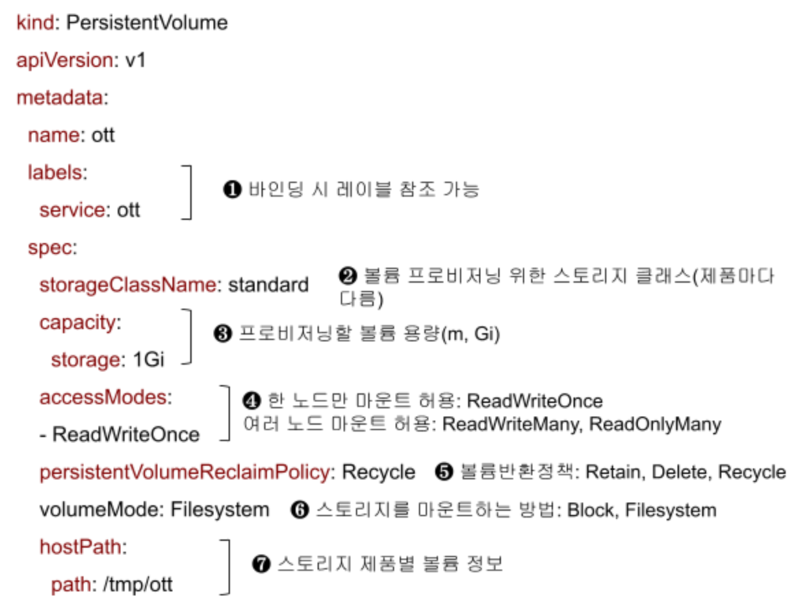  
- accessModes:   
  - ReadWriteOnce: RWO-한 노드에서만 볼륨 마운트를 할 수 있고 읽기/쓰기 허용
  - ReadWriteMany: RWX- 여러 노드에서 볼륨 마운트를 할 수 있고 읽기/쓰기 허용
  - ReadOnlyMany: ROX-여러 노드에서 볼륨 마운트를 할 수 있고 읽기만 허용
  - ReadWriteOncePod: RWOP-한 파드에서만 볼륨 마운트를 할 수 있고 읽기/쓰기 허용   
    
**5)Storage Class**   
각 스토리지 제품은 프로비저닝을 위한 스토리지 클래스가 있습니다.     
예를 들어 AKS는 아래와 같은 Storage Class들이 있습니다.    
여기에는 프로비저너의 이름, 볼륨 반환 정책, 볼륨 바인딩 정책, 확장 허용 여부가 정의되어 있습니다.   
```
k get sc
NAME                    PROVISIONER          RECLAIMPOLICY   VOLUMEBINDINGMODE      ALLOWVOLUMEEXPANSION   AGE
azurefile               file.csi.azure.com   Delete          Immediate              true                   2d4h
azurefile-csi           file.csi.azure.com   Delete          Immediate              true                   2d4h
azurefile-csi-premium   file.csi.azure.com   Delete          Immediate              true                   2d4h
azurefile-premium       file.csi.azure.com   Delete          Immediate              true                   2d4h
default (default)       disk.csi.azure.com   Delete          WaitForFirstConsumer   true                   2d4h
managed                 disk.csi.azure.com   Delete          WaitForFirstConsumer   true                   2d4h
managed-csi             disk.csi.azure.com   Delete          WaitForFirstConsumer   true                   2d4h
managed-csi-premium     disk.csi.azure.com   Delete          WaitForFirstConsumer   true                   2d4h
managed-premium         disk.csi.azure.com   Delete          WaitForFirstConsumer   true                   2d4h
```
**6)PVC 정의하기**   
   

새로운 퍼시스턴트 볼륨 클레임 오브젝트가 생성되면 ❶ 스토리지 클래스 네임, ❷ 볼륨 요청 크기, ❸ 접근 모드, ❹ 퍼시스턴트 볼륨 오브젝트 레이블 조건이 맞는   
퍼시스턴트 볼륨 오브젝트가 바인딩 됩니다.   
만약 조건에 맞는 퍼시스턴트 볼륨 오브젝트가 한개 이상이면 무작위로 한개가 선정되어 바인딩 됩니다.   
  
**7)자동 볼륨 생성(Dynamic Provisioning)**     
쿠버네티스는 퍼시스턴트 볼륨 클레임 오브젝트를 생성하면 자동으로 볼륨 디렉토리와 퍼시스턴트 볼륨 오브젝트를 생성하는 방법을 제공 합니다.  
이렇게 자동으로 볼륨 디렉토리와 퍼시스턴트 볼륨 오브젝트를 생성하는 것을 **동적 프로비저닝(Dynamic provisioning)**이라고 합니다.    
  
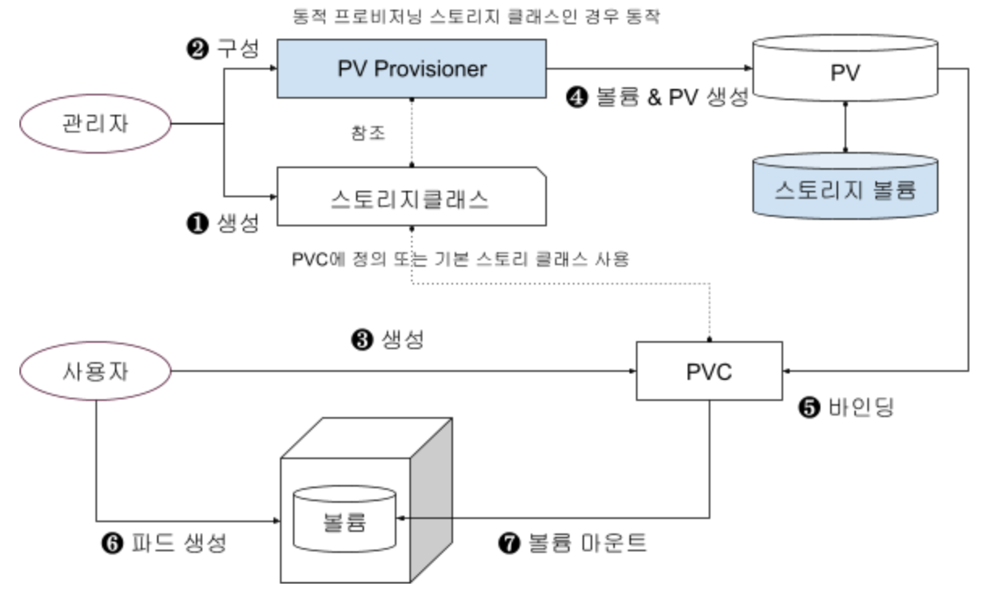  
  
❶ 동적 프로비저닝을 위한 동적 프로비저너를 설치합니다. 이 프로비저너도 파드로 생성이 됩니다.  
❷ 관리자는 동적 프로비저닝을 지원하는 스토리지 클래스를 미리 생성해야 합니다.   
볼륨 사용자가 PVC 오브젝트에 스토리지 클래스명을 지정하지 않았을때 자동으로 동적 프로비저닝이 되게 하려면 생성한 스토리지 클래스를 기본 클래스로 만듭니다.   
❸ 볼륨 사용자가 PVC 오브젝트를 생성 합니다.  
❹ 동적 프로비저너는 퍼시스턴트 볼륨 클레임 오브젝트에 정의되어 있는 스토리지 클래스의 내용을 참조 합니다.    
만약 퍼시스턴트 볼륨 클레임 오브젝트에 스토리지 클래스가 정의되어 있지 않으면 기본 스토리지 클래스를 참조 합니다.    
스토리지 볼륨에 볼륨을 생성하고 PV 오브젝트도 생성 합니다.       
❺ PV 오브젝트와 PVC 오브젝트가 바인딩 됩니다.   
❻ 볼륨 사용자가 파드를 실행 합니다.  
❼ PVC 오브젝트에 바인딩된 PV 오브젝트의 스토리지 볼륨이 파드안에 마운트 됩니다.   
   
AKS에 제공되는 스토리지 클래스는 모두 동적 프로비저닝을 지원 합니다.   
그래서 PVC만 만들면 자동으로 PV와 물리적 볼륨이 생성되고 바인딩 됩니다.      
   
좀 더 자세한 정보와 실습을 원하시면 [데이터 저장소 사용을 위한 PV/PVC](https://happycloud-lee.tistory.com/256)을 참조하세요.    


| [Top](#목차) |

---

## Manifest 점검 및 실행
백엔드 서비스에서 DB와 통신할 때 DB의 서비스 오브젝트명과 포트를 이용합니다.   
그 정보는 각 서비스별 ConfigMap에 정의되어 있습니다.   
member서비스의 ConfigMap은 아래와 같이 정의되어 있습니다.   
'member-postgresql'라는 이름과 '5432'포트로 수신하는 DB 서비스 오브젝트가 있어야 에러가 안 납니다.   
```
# lifesub/deployment/manifest/configmaps/member-config.yaml
apiVersion: v1
kind: ConfigMap
metadata:
  name: member-config
data:
  SERVER_PORT: "8081"
  POSTGRES_HOST: "member-postgresql"
  POSTGRES_PORT: "5432"
  POSTGRES_DB: "member"
```
  
아래 명령으로 Database 서비스 오브젝트의 이름과 포트가 정확한지 체크합니다.   
```bash
kubectl get svc
```  
  
| [Top](#목차) |

---

## manifest 실행

먼저 확실하게 최신 이미지가 반영될 수 있도록 기존 파드를 삭제 합니다.   
Deployment 매니페스트에 imagePullPolicy가 'Always'로 되어 있어 사실 안해도 됩니다.   
```
cd ~/workspace
k delete -f lifesub/deployment/manifest/deployments/
k delete -f lifesub-web/deployment/manifest/deployments/
```
   
이제 드디어 모든 준비가 완료 되었습니다.   
모든 오브젝트를 매니페스트 파일로 생성 또는 수정합니다.   
```bash
cd ~/workspace

# Ingreess 생성
kubectl apply -f lifesub/deployment/manifest/ingresses/

# ConfigMap 생성
kubectl apply -f lifesub/deployment/manifest/configmaps/

# Secret 생성
kubectl apply -f lifesub/deployment/manifest/secrets/

# Backend 서비스 배포
kubectl apply -f lifesub/deployment/manifest/deployments/
kubectl apply -f lifesub/deployment/manifest/services/

# Frontend 서비스 배포
kubectl apply -f lifesub-web/deployment/manifest/deployments/
kubectl apply -f lifesub-web/deployment/manifest/services/
```
k8s 오브젝트를 'k apply'로 생성하거나 'k delete'로 삭제할 때 위와 같이 디렉토리를 지정해도 됩니다.   
그럼 자동으로 그 디렉토리안의 매니페스트 파일들을 찾아 처리 합니다.   
디렉토리 뿐 아니라 접근할 수 있는 URL을 지정할 수도 있습니다.   
   
| [Top](#목차) |

--- 

## 정상 배포 확인
서비스가 정확히 생성되었는지와 파드가 정상적으로 실행되는지 확인합니다.   
```bash
# Service 상태 확인
kubectl get svc

# Pod 상태 확인
kubectl get pods -w
```
'-w' 옵션은 파드의 상태가 변할 때마다 로그처럼 새로운 줄로 파드의 상태를 제공합니다.   
파드가 많은 경우 보기 불편할 수 있습니다.   
아래 'watch'라는 리눅스 명령이 더 편합니다. 단, 이때는 'k' 대신 'kubectl'을 이용해야 합니다.   
```
watch kubectl get po
```

| [Top](#목차) |

--- 

## 테스트
Frontend Service의 External IP로 접속하여 서비스 동작을 확인 합니다.   
```
web_host=$(kubectl get svc lifesub-web -o jsonpath='{.status.loadBalancer.ingress[0].ip}' 2>/dev/null || true)
echo "테스트 주소: http://${web_host}"
```

| [Top](#목차) |

---

드디어 쿠버네티스라는 거대한 산의 첫 봉우리를 완등 하셨습니다.    
이렇게 짧은 시간에 너무 고생하셨고 여기까지 오신 자신에게 큰 칭찬해 주십시오^^   
이제 저 앞에 보이는 더 큰 산을 오를 충분한 준비가 되셨습니다.   
다음 단계로 계속 진행해 보자고요.   

  