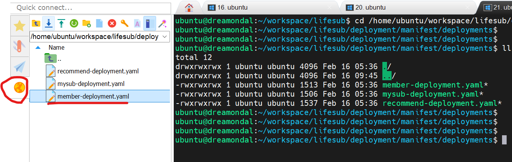
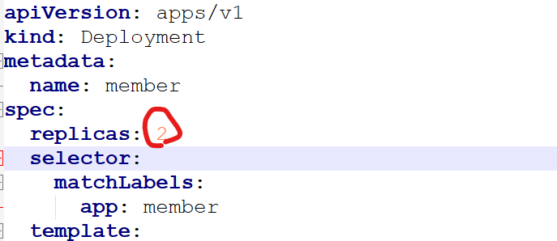
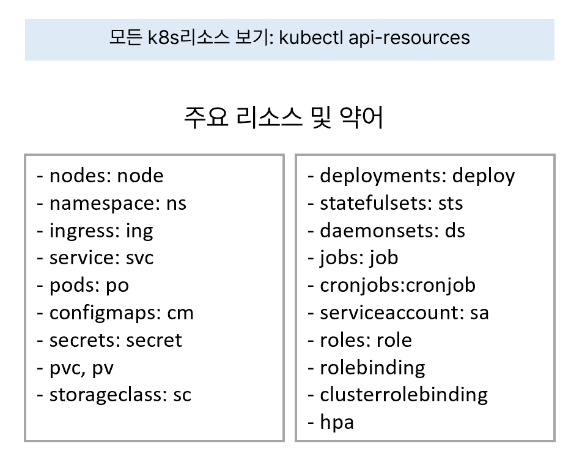
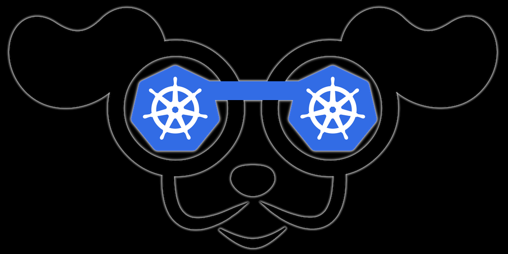

# 쿠버네티스 명령어 실습

## 목차  
- [쿠버네티스 명령어 실습](#쿠버네티스-명령어-실습)
  - [목차](#목차)
  - [로그인](#로그인)
  - [객체 생성 및 수정: kubectl apply](#객체-생성-및-수정-kubectl-apply)
  - [객체 리스트 조회: kubectl get](#객체-리스트-조회-kubectl-get)
  - [객체 정보 보기: kubectl describe](#객체-정보-보기-kubectl-describe)
  - [파드 로그 보기: kubectl logs \[-f\]](#파드-로그-보기-kubectl-logs--f)
  - [파드 내 명령 내리기: kubectl exec -it](#파드-내-명령-내리기-kubectl-exec--it)
  - [객체 수정: kubectl edit](#객체-수정-kubectl-edit)
  - [객체 삭제: kubectl delete](#객체-삭제-kubectl-delete)
  - [수동 스케일링: kubectl scale](#수동-스케일링-kubectl-scale)
  - [파드 재시작 하기: kubectl rollout](#파드-재시작-하기-kubectl-rollout)
  - [k8s 클러스터 외부에서 포트 Forward하여 파드 접근하기: kubectl port-forward](#k8s-클러스터-외부에서-포트-forward하여-파드-접근하기-kubectl-port-forward)
  - [유지보수 관련 명령: cordon, uncordon, drain, taint](#유지보수-관련-명령-cordon-uncordon-drain-taint)
  - [k9s](#k9s)


## 로그인
Window사용자는 MobaXTerm의 Local Ubuntu에서 작업하고 맥/리눅스 사용자는 터미널에서 작업하십시오.    

작업 디렉토리를 만들고 이동합니다.   
```
mkdir -p ~/work && cd ~/work
```

## 객체 생성 및 수정: kubectl apply    
Deployment 매니페스트가 있는 디렉토리로 이동합니다.  
```
cd ~/workspace/lifesub/deployment/manifest/deployments/
ll
```

좌측 WSL Browser에서 member-deployment.yaml 파일을 더블클릭하여 NotePad++에서 엽니다.  
  

replicas를 2로 수정하고 저장합니다.  
 

현재 member 파드의 갯수를 확인해 보세요.  1개만 있을 겁니다.   
아래 명령으로 매니페스트 내용을 적용하고 2개로 늘어 나는지 확인 합니다.    
```
k apply -f member-deployment.yaml  
k get po 
```

| [Top](#목차) |

---

## 객체 리스트 조회: kubectl get 
생성된 모든 오브젝트들을 봅니다.  
```
kubectl get all
```

각 리소스 종류별로 오브젝트를 조회합니다.  
```
k get po
k get deploy
k get sts
k get svc
k get ing
k get cm
k get secret
k get pv
k get pvc
```

다른 네임스페이스의 오브젝트도 조회 해 봅니다. 
위 명령 끝에 '-n {조회할 네임스페이스명}'을 붙이면 됩니다.  
```
kubectl get po -n kube-system
```

오브젝트의 yaml 내용을 조회해 봅니다.   
```
kubectl get deploy member -o yaml
```

yaml내용을 파일로 저장해 봅니다.  
```
kubectl get deploy member -o yaml > tmp.yaml 
```

오브젝트의 label을 조회해 봅니다.  pod이름은 본인 것으로 변경해야 합니다.   
```
kubectl get deploy member --show-labels
k get po
kubectl get po {pod명} --show-labels  
```

오브젝트의 좀 더 많은 정보를 '-o wide'를 붙여 확인합니다.   
```
kubectl get deploy member -o wide --show-labels
kubectl get po node -o wide --show-labels  
```

모든 네임 스페이스에서 오브젝트 리스트를 확인 합니다.   
```
kubectl get po -A
kubectl get deploy -A
kubectl get svc -A
kubectl get ing -A
```

아래는 자주 사용하는 k8s 리소스입니다.  
  

전체 리소스를 보려면 아래 명령으로 보면 됩니다.  
```
k api-resources
```

| [Top](#목차) |

---

## 객체 정보 보기: kubectl describe  
원하는 객체의 정보를 조회 합니다.   
```
k get po
kubectl describe po {pod명}
kubectl describe deploy member
kubectl describe svc member
```

가장 많이 사용 하게될 리소스는 pod 일 것입니다.   
파드가 제대로 실행 안 되었을 때 그 원인을 찾을 때 describe를 매우 많이 사용합니다.  

아래 예와 같이 'Events' 부분을 보고 문제를 해결해 나갑니다.   
이미지를 풀링 실패, Readiness Probe 실패, 런타임 실패로 재시작 등이 많이 나오는 유형입니다.  
```
k get po | grep member
member-569f6b555d-jggww        1/1     Running   0              6m56s
member-569f6b555d-ksrvc        1/1     Running   0              7h36m
member-postgresql-0            1/1     Running   2 (8h ago)     14h


k describe po member-569f6b555d-jggww

...

Events:
  Type    Reason     Age   From               Message
  ----    ------     ----  ----               -------
  Normal  Scheduled  7m5s  default-scheduler  Successfully assigned dg0200-lifesub-ns/member-569f6b555d-jggww to aks-nodepool1-18726331-vmss000006
  Normal  Pulling    7m5s  kubelet            Pulling image "dg0200cr.azurecr.io/lifesub/member:1.0.0"
  Normal  Pulled     7m5s  kubelet            Successfully pulled image "dg0200cr.azurecr.io/lifesub/member:1.0.0" in 209ms (209ms including waiting). Image size: 375474773 bytes.
  Normal  Created    7m5s  kubelet            Created container member
  Normal  Started    7m5s  kubelet            Started container member

```

| [Top](#목차) |

---

## 파드 로그 보기: kubectl logs [-f]
파드 로그를 확인해 봅니다.  
```
k get po 
kubectl logs member-569f6b555d-jggww
```

'-f'옵션을 붙이면 log를 실시간 스트리밍할 수 있습니다.   

```
k get po | grep recommend
recommend-6c6f858486-bpz9l     1/1     Running   0               7h43m
recommend-postgresql-0         1/1     Running   1 (12h ago)     14h

kubectl logs -f recommend-6c6f858486-bpz9l
```

deploy객체를 이용하여 관리하는 파드의 로그를 볼 수도 있습니다.   
파드명은 재생성하면 바뀌므로 파드가 1개일 때는 deploy를 이용 하기도 합니다.  
'/'로 구분하여 지정한다는거에 유의하세요.   
```
k logs -f deploy/member 
```

그리고 웹 브라우저에서 구독서비스를 로그인한 후 메인화면을 리프레시 해 보십시오.  
로그가 실시간으로 나오는 걸 확인할 수 있습니다.  

CTRL-C를 눌러 빠져 나오세요.  

만약 Pod안에 container가 2개 이상이면 '-c' 옵션으로 로그를 볼 컨테이너명을 지정해 줘야 합니다.   

| [Top](#목차) |

---

## 파드 내 명령 내리기: kubectl exec -it 

docker exec에서는 명령 앞에 아무것도 없었으나 kubectl은 '--'를 붙여줘야 수행됩니다.   
'--' 뒤에 파드 내에 내릴 명령을 입력하면 됩니다.   
```
k exec -it member-569f6b555d-jggww -- ls -al /
```

아래 명령으로 파드 내부로 진입합니다.  
진입 후 pwd로 현재 위치를 확인해 보고, ls -al로 app.jar파일이 있는지 확인합니다.   
Dockerfile에서 WORKDIR로 현재 디렉토리를 지정하고 COPY명령으로 jar를 복사했다는 것을 떠올리시길 바랍니다.  

```
kubectl exec -it member-569f6b555d-jggww -- bash

pwd
ls -al
```
exit를 입력하여 파드를 빠져 나옵니다.  


| [Top](#목차) |

---

## 객체 수정: kubectl edit
예제로 Service 객체를 수정해 보겠습니다.   
아래 명령으로 Service 'member'의 편집 모드로 진입합니다.   
```
kubectl edit svc member
```

맨 끝에 쯤 있는 type: ClusterIP를 type: NodePort로 변경합니다.  
ESC를 누르고 ':wq'를 눌러 저장하고 닫습니다.   

Service를 조회해 봅니다.  뭐가 달라졌나요?  
```
kubectl get svc
```

PORT(S)의 ':' 뒤에 있는 포트가 외부 포트입니다.  이 포트로 브라우저에서 접근해 보십시오.   
예를 들어 외부 포트가 31677이면 아래와 같이 접근할 수 있습니다.   
이때 Host는 k8s 노드중 아무 노드의 Public IP를 지정하면 됩니다.   
우리는 k8s 노드들이 외부에 오픈 안되어 있으므로 테스트는 못하겠네요.  
```
http://43.200.12.214:31677/swagger-ui.html  
```

| [Top](#목차) |

---

## 객체 삭제: kubectl delete  
파드를 삭제 해 보십시오.  
```
k get po | grep mysub
kubectl delete po {mysub pod명}
```

1개 뿐인 파드를 지웠으니 이제 파드는 하나도 없겠네요.    
다시 한번 파드 리스트를 확인해 보세요.   
파드가 있습니다.  안 지워진걸까요? 누가 다시 만든걸까요?     
잘 보시면 파드이름이 그 전 파드와 다릅니다. 다시 만들어진겁니다.     
누가 다시 만들었을까요?  쿠버네티스 아키텍처에서 어떤 컴포넌트일까요?      
  
Controller Manager입니다.  
  

어떤 리소스가 다시 만든걸까요?  

Workload Controller입니다.  그 중에서도 mysub 파드를 관리하는 Deployment 'mysub'객체입니다.  

  
그럼 파드를 완전히 삭제하려면 어떻게 해야 할까요?    
파드를 배포한 워크로드 컨트롤러를 삭제해야 합니다.   
   
아래와 같이 deployment 객체를 지워 보십시오.   
```
kubectl delete deploy mysub   
```

이제 파드를 조회 해 보면 삭제되었을 겁니다.   

리소스유형을 지정하여 해당 리소스로 생성된 모든 객체를 삭제할 수 있습니다.   
아래 명령으로 모든 service객체를 삭제해 보십시오.  
```
kubectl delete svc --all
```
> 주의: Secret은 한꺼번에 삭제 하지 마세요.   
> 이렇게 한꺼번에 삭제하는 건 실수 할 수 있으니 가급적 사용하지 마세요.    

yaml 파일을 지정하여 그 파일에 정의된 객체를 한꺼번에 삭제할 수 있습니다.   
```
kubectl delete -f mysub-deployment.yaml
```

파드 객체 리스트를 조회해 보면 모두 사라진 걸 확인할 수 있을겁니다.   
```
k get svc deploy 
```

파드가 잘 삭제 안될 경우가 있습니다.  
강제로 삭제하는 방법으로 '--force'와 '--grace-period=0'을 같이 쓰면 즉시 삭제 됩니다.  
```
k get po | grep member
k delete member-569f6b555d-jggww
k get po | grep member 
k delete po member-569f6b555d-jggww --force --grace-period=0
k get po | grep member
```


다시 실습을 위해 지운 객체를 다시 생성합니다.   
바로 위 디렉토리로 이동하여 deployments와 services 디렉토리를 지정하여 생성해 봅니다.   
```
cd ..

k apply -f deployments
deployment.apps/member configured
deployment.apps/mysub configured
deployment.apps/recommend configured

k apply -f services
service/member unchanged
service/mysub unchanged
service/recommend unchanged

```

| [Top](#목차) |

---

## 수동 스케일링: kubectl scale   
파드의 갯수를 수동으로 조정할 수 있습니다.  
```
k scale --replicas=2 deploy member 
```

파드를 일시적으로 중단시키는 방법으로 응용할 수도 있습니다.  
```
k scale --replicas=0 deploy member 
```

다시 원복 합니다.  
```
k scale --replicas=1 deploy member 
```

| [Top](#목차) |

---

## 파드 재시작 하기: kubectl rollout 
파드를 관리하는 Workload Controller 객체를 이용하여 파드를 재시작 할 수 있습니다.   
```
k get po | grep member
member-555df65b6c-2rhxc        1/1     Running   0               83s
...

# deployment객체를 이용하여 파드를 재시작합니다.  
k rollout restart deploy member
deployment.apps/member restarted

# 파드명을 잘 보면 1번째는 기존 파드이고, 2번째 새로운 파드가 시작되었습니다.  
k get po | grep member
member-555df65b6c-2rhxc        1/1     Running   0               4m45s
member-64945c6c44-x5228        0/1     Running   0               4s
...

# 예전 파드를 강제로 삭제합니다. (기본으로 30초 동안 유지됩니다. )
k delete po member-555df65b6c-2rhxc --force --grace-period=0
Warning: Immediate deletion does not wait for confirmation that the running resource has been terminated. The resource may continue to run on the cluster indefinitely.
pod "member-555df65b6c-2rhxc" force deleted

# 새로운 파드가 정상적으로 시작 되었습니다.  
k get po | grep member
member-64945c6c44-x5228        1/1     Running   0               50s
member-postgresql-0            1/1     Running   2 (9h ago)      15h

```

| [Top](#목차) |

---

## k8s 클러스터 외부에서 포트 Forward하여 파드 접근하기: kubectl port-forward 
개발 시ㅣ 테스트 목적으로 클라이언트에서 파드를 접근하여야 할 경우가 자주 있습니다.  
파드는 서비스 리소스를 통해 접근 하므로 서비스를 포트 Forward 하면 됩니다.   
서비스의 유형이 어떤 것이든 모두 됩니다.

아래와 같이 member 서비스를 포트 Forward 합니다.  
```
k port-forward svc member 8888:80
```

웹브라우저에서 http://localhost:8888/swagger-ui.html 으로 접근합니다.  


| [Top](#목차) |

---

## 유지보수 관련 명령: cordon, uncordon, drain, taint
각 명령어들은 쿠버네티스 노드 관리를 위한 kubectl 명령어들입니다.    

1.cordon/uncordon: 노드에 새로운 파드가 스케줄링되는 것을 방지하거나 방지 해제  
cordon 된 노드는 STATUS에 'SchedulingDisabled'라고 표시됩니다.     
```bash
ubuntu@dreamondal:~$ k get nodes
NAME                                STATUS   ROLES    AGE    VERSION
aks-nodepool1-18726331-vmss000000   Ready    <none>   2d9h   v1.30.9
aks-nodepool1-18726331-vmss000001   Ready    <none>   2d9h   v1.30.9
aks-nodepool1-18726331-vmss000006   Ready    <none>   18h    v1.30.9
aks-nodepool1-18726331-vmss000008   Ready    <none>   9h     v1.30.9
ubuntu@dreamondal:~$ k cordon aks-nodepool1-18726331-vmss000008
node/aks-nodepool1-18726331-vmss000008 cordoned
ubuntu@dreamondal:~$ k get nodes
NAME                                STATUS                     ROLES    AGE    VERSION
aks-nodepool1-18726331-vmss000000   Ready                      <none>   2d9h   v1.30.9
aks-nodepool1-18726331-vmss000001   Ready                      <none>   2d9h   v1.30.9
aks-nodepool1-18726331-vmss000006   Ready                      <none>   18h    v1.30.9
aks-nodepool1-18726331-vmss000008   Ready,SchedulingDisabled   <none>   9h     v1.30.9
ubuntu@dreamondal:~$ k uncordon aks-nodepool1-18726331-vmss000008
node/aks-nodepool1-18726331-vmss000008 uncordoned
ubuntu@dreamondal:~$ k get nodes
NAME                                STATUS   ROLES    AGE    VERSION
aks-nodepool1-18726331-vmss000000   Ready    <none>   2d9h   v1.30.9
aks-nodepool1-18726331-vmss000001   Ready    <none>   2d9h   v1.30.9
aks-nodepool1-18726331-vmss000006   Ready    <none>   18h    v1.30.9
aks-nodepool1-18726331-vmss000008   Ready    <none>   9h     v1.30.9
```

2.drain: 노드의 파드들을 다른 노드로 이동  
노드의 유지보수 준비를 위해 모든 파드를 내쫒는 명령입니다.  
실습하지는 마세요.  
```bash
# node1의 모든 파드를 다른 노드로 이동
kubectl drain node1 --ignore-daemonsets
```

3.taint: 노드에 테인트를 설정하여 파드 스케줄링 제어   
cordon처럼 노드에 모든 스케쥴링을 금지하는게 아니라 특정 조건에 해당하는 파드만 스케쥴링 하기 위한 목적으로 사용됩니다.  

아래 예에서 normal-pod는 node1에 스케줄링되지 않고, tolerating-pod는 스케줄링이 될 수 있습니다.  
테인트가 걸린 노드에 파드를 배포할 때는 'tolerations' 조건을 이용합니다.  
```
# 1. 노드에 테인트 설정
kubectl taint nodes node1 app=blue:NoSchedule

# 2. 톨러레이션이 없는 일반 파드
apiVersion: v1
kind: Pod
metadata:
  name: normal-pod
spec:
  containers:
  - name: nginx
    image: nginx

# 3. 톨러레이션이 있는 파드
apiVersion: v1
kind: Pod
metadata:
  name: tolerating-pod
spec:
  containers:
  - name: nginx
    image: nginx
  tolerations:
  - key: "app"
    operator: "Equal"
    value: "blue"
    effect: "NoSchedule"
```

| [Top](#목차) |

---

## k9s
[k9s](https://k9scli.io/)는 쿠버네티스 클러스터 관리를 도와주는 편리한 툴입니다.   
  

아래 글에서 설치와 사용법을 익히십시오.  
https://happycloud-lee.tistory.com/237

| [Top](#목차) |

---


